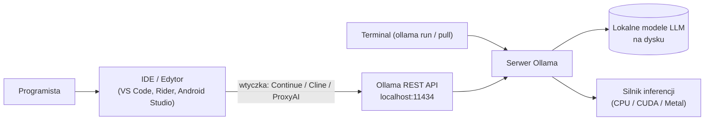
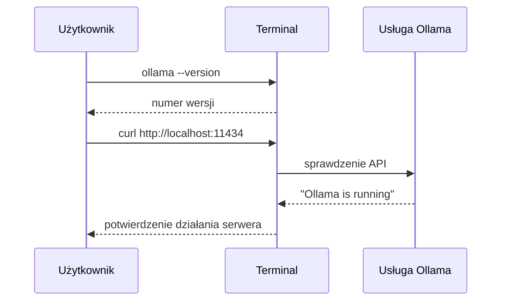
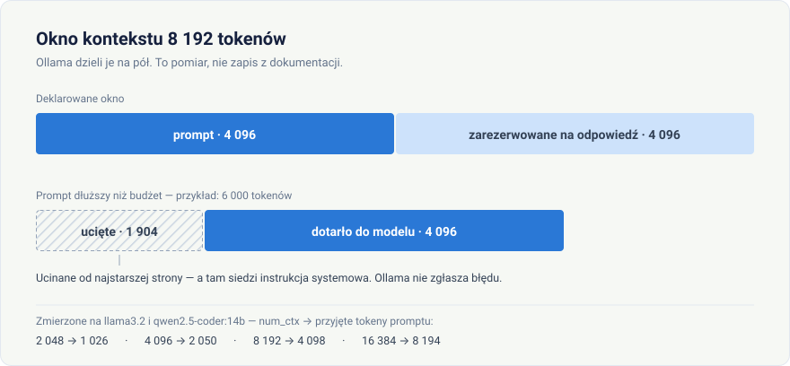
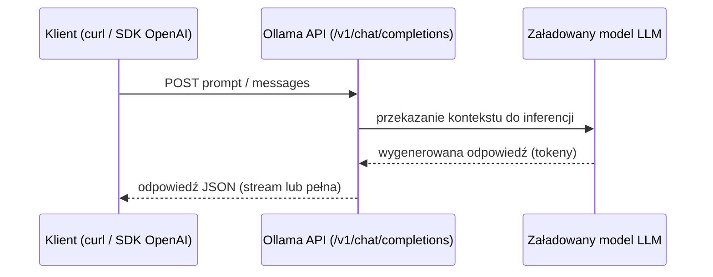
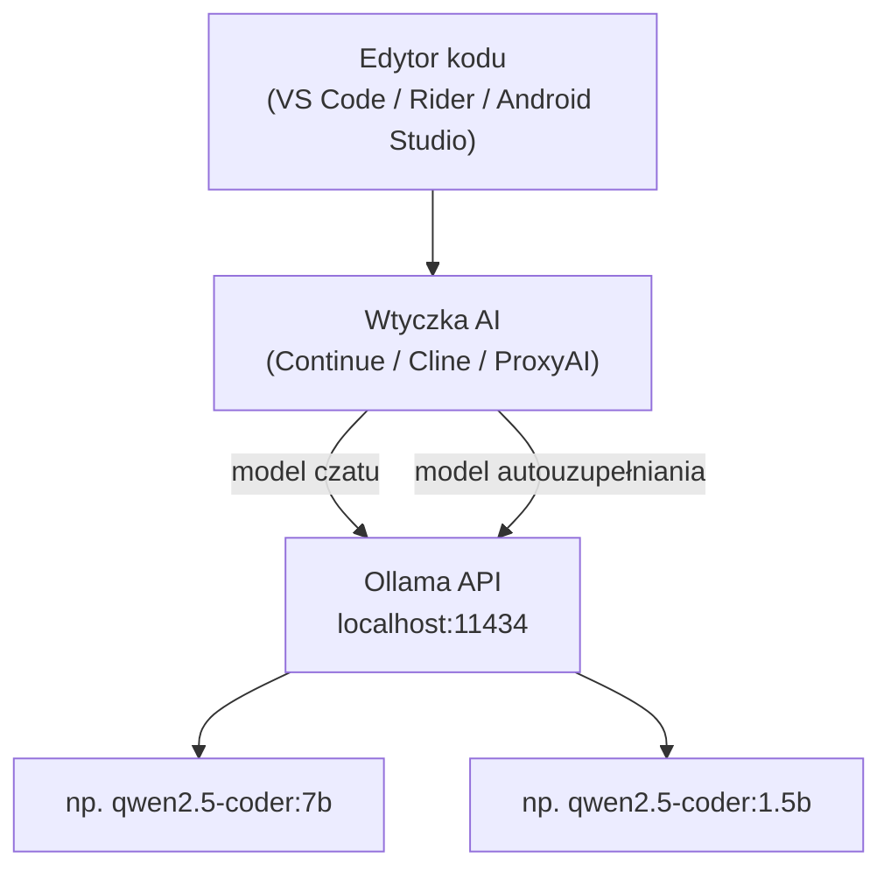

# Uruchamianie lokalnych agentów AI w oparciu o Ollama

<p align="center">
  
</p>

> Seria szkoleniowa: **Lokalni agenci AI dla programistów** — odcinek 1

> **Dla początkujących:** to pierwszy odcinek serii i zakładamy tylko tyle, że potrafisz otworzyć terminal (macOS/Linux) albo PowerShell (Windows). Najkrótsza droga do efektu prowadzi przez [instalację](#instalacja-ollama) i [pierwszy model](#pobieranie-i-uruchamianie-pierwszego-modelu) — około 15 minut, z czego większość to pobieranie modelu. Tabele z doborem modeli, konfigurację IDE i strojenie serwera możesz przeczytać później; nie są potrzebne, żeby zacząć.

> **Krótkie wyjaśnienie pojęć**, które pojawiają się w tym odcinku:
> - **Model językowy (LLM)** — program wytrenowany na ogromnej ilości tekstu, który przewiduje dalszy ciąg tego, co dostał na wejściu. Stąd bierze się zarówno pisanie kodu, jak i odpowiadanie na pytania.
> - **Inferencja** — samo uruchomienie modelu, czyli liczenie odpowiedzi. Zajmuje się tym procesor albo karta graficzna i to od niego zależy, jak długo czekasz na tekst.
> - **Prompt** — to, co wysyłasz do modelu: pytanie, polecenie, fragment kodu.
> - **Token** — kawałek tekstu, na jaki model tnie to, co dostaje: najczęściej fragment słowa, rzadziej całe słowo. Wszystkie limity i rozmiary w tym odcinku liczą się w tokenach, nie w znakach — i, co ważne dla piszących po polsku, jeden token to znacznie mniej polskiego tekstu niż angielskiego.
> - **Kontekst** — wszystko, co model widzi w danym zapytaniu (prompt plus wcześniejsza część rozmowy). Jest ograniczony, więc bardzo długie rozmowy zaczynają modelowi „wypadać" z pamięci.
> - **Agent** — model wpięty w pętlę: dostaje zadanie, może sięgnąć po narzędzie (odczytać plik, uruchomić polecenie), zobaczyć wynik i dopiero wtedy odpowiedzieć. Najprostszego takiego agenta budujemy pod koniec tego odcinka.

## Wprowadzenie

Coraz więcej zespołów programistycznych chce korzystać z modeli językowych (LLM) bez wysyłania kodu i danych do zewnętrznych chmur. Odpowiedzią na tę potrzebę jest uruchamianie modeli **lokalnie**, na własnym komputerze lub serwerze. W tym odcinku pokażemy, jak przygotować środowisko lokalne do pracy z agentami AI w oparciu o **Ollama** — jedno z najpopularniejszych narzędzi do uruchamiania modeli LLM offline.

### Dlaczego lokalne modele?

- **Prywatność** – kod, dane firmowe i prompty nie opuszczają Twojej maszyny.
- **Koszty** – brak opłat za tokeny w modelu subskrypcyjnym/API.
- **Brak zależności od sieci** – możliwość pracy offline, np. w podróży lub w środowiskach o ograniczonym dostępie do internetu.
- **Pełna kontrola** – wybór wersji modelu, parametrów, fine-tuningu.

### Czym jest Ollama?

[Ollama](https://ollama.com) to lekkie narzędzie (CLI + serwer lokalny), które pozwala pobierać, uruchamiać i zarządzać modelami LLM (np. Llama, Mistral, Qwen, Gemma, DeepSeek) na lokalnym komputerze. Ollama udostępnia lokalne REST API kompatybilne w dużej mierze z formatem OpenAI, dzięki czemu łatwo integruje się z istniejącymi narzędziami i bibliotekami (np. LangChain, LlamaIndex, VS Code, Continue).



## Wymagania wstępne

Zanim zaczniemy, upewnij się, że posiadasz:

- System operacyjny: **Windows 10/11, macOS lub Linux**. Na Windows instalujesz zwykłą aplikację `.exe` i pracujesz w PowerShell — WSL2 jest potrzebne tylko wtedy, gdy kod, nad którym pracujesz, i tak żyje w WSL. Wtedy zainstaluj Ollamę **wewnątrz** WSL, według instrukcji dla Linuksa.
- Minimum 8 GB RAM (16 GB+ zalecane dla większych modeli).
- Wolne miejsce na dysku: 5–20 GB w zależności od wybranych modeli.
- Opcjonalnie: karta graficzna z obsługą CUDA (NVIDIA) lub Metal (Apple Silicon) dla przyspieszenia inferencji — nie jest wymagana, Ollama działa również na samym procesorze.
- Opcjonalnie: **Python 3.10+**, jeśli chcesz przejść przez przykłady kodu z sekcji o REST API i o budowie agenta. Do wcześniejszych kroków nie jest potrzebny.

## Instalacja Ollama

### macOS

```bash
brew install ollama
```

Alternatywnie można pobrać instalator ze strony [ollama.com/download](https://ollama.com/download).

### Linux

```bash
curl -fsSL https://ollama.com/install.sh | sh
```

### Windows

Pobierz i uruchom instalator `.exe` ze strony [ollama.com/download](https://ollama.com/download). Po instalacji Ollama siedzi w zasobniku systemowym (obok zegara) i startuje razem z zalogowaniem do systemu — nie jest to usługa Windows, tylko zwykła aplikacja użytkownika.

Polecenia z tego odcinka wpisujesz w **PowerShell**: klawisz `Win`, wpisz „PowerShell", `Enter`. Nie potrzebujesz uprawnień administratora.

### Weryfikacja instalacji

```bash
ollama --version
```

Sprawdź, czy serwer odpowiada:

```bash
curl http://localhost:11434
# oczekiwana odpowiedź: Ollama is running
```

> **Windows:** w PowerShell `curl` jest aliasem na `Invoke-WebRequest` i zachowuje się inaczej niż narzędzie znane z Linuksa — w szczególności nie rozumie przełącznika `-d`. Windows 10 i 11 mają jednak w komplecie prawdziwego curla, więc we wszystkich przykładach w tym odcinku wpisuj **`curl.exe`** zamiast `curl`.

Jeśli dostałeś odpowiedź „Ollama is running", środowisko jest gotowe — możesz przejść od razu do pobrania pierwszego modelu. Jeśli połączenie zostało odrzucone, uruchom serwer ręcznie:

```bash
ollama serve
```

> Gdy `ollama serve` kończy się błędem `address already in use`, to **nie jest awaria** — serwer już działa w tle. Ten i pozostałe problemy startowe zebraliśmy w aneksie [„Kiedy coś nie działa i jak dostroić serwer"](#kiedy-coś-nie-działa-i-jak-dostroić-serwer) na końcu odcinka.

Domyślnie serwer nasłuchuje na `http://localhost:11434`.



## Pobieranie i uruchamianie pierwszego modelu

Ollama udostępnia bibliotekę gotowych modeli w [ollama.com/library](https://ollama.com/library). Do pierwszych testów polecamy mniejsze modele, np. `llama3.2` lub `qwen2.5`.

```bash
# Pobranie modelu
ollama pull llama3.2

# Uruchomienie interaktywnej sesji czatu w terminalu
ollama run llama3.2
```

Przykładowa interakcja:

```text
>>> Napisz funkcję w Pythonie sumującą listę liczb
def suma(lista):
    return sum(lista)
```

Aby zakończyć sesję, wpisz `/bye`.

### Sprawdzanie zainstalowanych modeli

Aby zobaczyć, które modele są już pobrane lokalnie:

```bash
ollama list
```

Przykładowy wynik:

```text
NAME                       ID              SIZE      MODIFIED
qwen2.5-coder:7b           abcd1234ef56    4.7 GB    2 dni temu
llama3.2:latest            1234abcd5678    2.0 GB    5 dni temu
```

Dodatkowe komendy do zarządzania modelami:

```bash
ollama show qwen2.5-coder:7b   # szczegóły modelu: parametry, kontekst, licencja
ollama ps                      # modele aktualnie załadowane do pamięci (RAM/VRAM)
ollama rm llama3.2             # usunięcie modelu z dysku
ollama cp llama3.2 moj-model   # utworzenie kopii/aliasu modelu (np. do dalszej personalizacji)
```

Kolumna `NAME` w `ollama list` odpowiada identyfikatorowi używanemu w API i konfiguracji IDE (`model: "qwen2.5-coder:7b"`), a `ollama ps` pozwala szybko zdiagnozować, czy dany model faktycznie jest aktywny w pamięci w danym momencie (przydatne przy analizie wydajności).

## Jakie modele wybrać do programowania?

Dobór modelu zależy od dwóch czynników: **języka/typu zadania** oraz **dostępnego sprzętu** (RAM, VRAM, typ procesora). Poniżej zestawienia pomocne przy pierwszym wyborze.

### Co oznacza "rozmiar modelu"?

Nazwy modeli w Ollamie zawierają liczbę z literą `b`, np. `qwen2.5-coder:7b` lub `llama3.1:70b`. Oznacza to liczbę **parametrów** modelu — wag sieci neuronowej wyuczonych podczas treningu — wyrażoną w miliardach (ang. *billion*, stąd `b`). Im więcej parametrów, tym model jest zazwyczaj "mądrzejszy" (lepiej radzi sobie ze złożonym kontekstem i rozumowaniem), ale też wolniejszy i wymaga więcej pamięci.

Rozmiar parametrów nie jest jednak jedynym czynnikiem wpływającym na zapotrzebowanie na pamięć i miejsce na dysku — równie ważna jest **kwantyzacja**:

- Model w oryginalnej precyzji (np. FP16 — liczby zmiennoprzecinkowe 16-bitowe) zajmuje bardzo dużo pamięci — w przybliżeniu **2 GB na każdy 1 miliard parametrów**.
- **Kwantyzacja** to technika kompresji wag modelu do mniejszej precyzji (np. 4-bitowej zamiast 16-bitowej), co znacząco zmniejsza rozmiar pliku i zużycie RAM/VRAM, kosztem niewielkiego spadku jakości odpowiedzi.
- Ollama domyślnie pobiera modele w kwantyzacji **Q4** (4-bitowej), która w praktyce zajmuje około **0,5–0,7 GB na 1 miliard parametrów** — stąd model `7b` waży ~4–5 GB, a nie ~14 GB.

Przykład: `qwen2.5-coder:7b` to model z ok. 7 miliardami parametrów, domyślnie w kwantyzacji Q4 (rozmiar pliku ok. 4,7 GB — widoczny w kolumnie `SIZE` w `ollama list`). Ten sam model można pobrać w innej kwantyzacji, podając tag jawnie, np.:

```bash
ollama pull qwen2.5-coder:7b-q8_0   # wyższa precyzja, lepsza jakość, większy rozmiar i zużycie pamięci
ollama pull qwen2.5-coder:7b-q4_K_M # domyślny/zbalansowany wariant Q4 (zwykle pobierany automatycznie)
```

**W praktyce, wybierając model, warto kierować się dwoma liczbami z jego nazwy/opisu:**

1. **Liczba parametrów** (`7b`, `14b`, `32b`...) — decyduje o jakości i "inteligencji" modelu oraz o wymaganej pamięci.
2. **Poziom kwantyzacji** (`q4`, `q8`, brak = zwykle Q4) — decyduje o tym, ile faktycznie ta pamięć wynosi oraz jak bardzo skompresowana (a więc potencjalnie mniej precyzyjna) jest wiedza modelu.

Tabele w kolejnej sekcji zakładają domyślną kwantyzację Q4 pobieraną automatycznie przez `ollama pull`.

### Modele pod kątem języka programowania / zastosowania

| Zastosowanie | Rekomendowany model (Ollama tag) | Uwagi |
|---|---|---|
| Ogólne programowanie (Python, JS/TS, Go) | `qwen2.5-coder:7b` | Dobry balans jakości i szybkości, silne wsparcie tool calling |
| C# / .NET / Rider | `qwen2.5-coder:14b` lub `deepseek-coder-v2:16b` | Lepsze rozumienie dużych rozwiązań `.sln`, wymaga więcej RAM/VRAM |
| Kotlin / Java / Android Studio | `qwen2.5-coder:7b` (lekki sprzęt) / `deepseek-coder-v2:16b` (mocny sprzęt) | Dobra znajomość Gradle, API Androida |
| Web/frontend (React, Vue, CSS) | `qwen2.5-coder:7b` | Szybkie odpowiedzi, wystarczające dla komponentów UI |
| Skrypty, DevOps, Bash/YAML | `llama3.1:8b` | Dobre ogólne rozumienie configów i poleceń shell |
| Dokumentacja, opisy, README | `llama3.2:3b` lub `llama3.1:8b` | Nie wymaga specjalizacji kodowej, liczy się płynność języka |
| Duże, złożone refaktoryzacje / analiza architektury | `deepseek-coder-v2:16b` lub `qwen2.5-coder:32b` | Najwyższa jakość, wymaga dużo RAM/VRAM (patrz tabela sprzętowa) |
| Autouzupełnianie inline (tab-autocomplete) | `qwen2.5-coder:1.5b` lub `starcoder2:3b` | Priorytetem jest niska latencja, nie jakość pojedynczej odpowiedzi |

### Dobór modelu do sprzętu

Poniższa tabela pokazuje orientacyjne minimalne wymagania pamięciowe (RAM dla CPU, VRAM dla GPU) dla typowych rozmiarów modeli w domyślnej kwantyzacji Ollamy (Q4).

| Rozmiar modelu | Minimalna pamięć (CPU/RAM) | Minimalna pamięć (GPU/VRAM) | Przykładowe modele |
|---|---|---|---|
| ~1.5–3B | 4–6 GB RAM | 2–4 GB VRAM | `qwen2.5-coder:1.5b`, `llama3.2:3b`, `starcoder2:3b` |
| ~7–8B | 8–10 GB RAM | 6–8 GB VRAM | `qwen2.5-coder:7b`, `llama3.1:8b`, `mistral-nemo:12b`* |
| ~13–16B | 16 GB RAM | 10–12 GB VRAM | `qwen2.5-coder:14b`, `deepseek-coder-v2:16b` |
| ~32B+ | 32 GB+ RAM | 20–24 GB+ VRAM | `qwen2.5-coder:32b`, `llama3.1:70b` (wymaga znacznie więcej) |

\*`mistral-nemo:12b` orientacyjnie pomiędzy grupą 7–8B a 13–16B.

### Rekomendacje w zależności od platformy sprzętowej

| Platforma | Rekomendacja | Komentarz |
|---|---|---|
| Apple Silicon (M1/M2/M3/M4), 16 GB RAM | modele do 7–8B (`qwen2.5-coder:7b`) | Pamięć jest współdzielona (unified memory) — GPU (Metal) korzysta z tej samej puli co CPU |
| Apple Silicon, 32 GB+ RAM | modele 13–16B, przy 64 GB+ nawet 32B | Więcej unified memory pozwala na komfortową pracę z większymi modelami |
| Intel/AMD CPU bez GPU dedykowanego | modele do 7–8B | Inferencja czysto na CPU jest wolniejsza — mniejszy model = krótszy czas odpowiedzi |
| Intel/AMD + NVIDIA GPU (CUDA), 8 GB VRAM | modele 7–8B w pełni na GPU | Ollama automatycznie wykrywa i wykorzystuje CUDA, jeśli sterowniki NVIDIA są zainstalowane |
| Intel/AMD + NVIDIA GPU (CUDA), 16–24 GB VRAM | modele 13–16B, częściowo 32B | Przy niewystarczającym VRAM Ollama automatycznie odciąża część warstw do CPU (wolniej, ale nadal działa) |
| Serwer/stacja robocza z wieloma GPU | modele 32B+ / 70B | Wymaga dystrybucji warstw modelu między karty — sprawdź `ollama ps` pod kątem wykorzystania VRAM na każdej karcie |

> **Wskazówka:** zawsze zaczynaj od najmniejszego modelu z danej kategorii zastosowania i sprawdzaj czas odpowiedzi (`ollama run <model> --verbose` pokazuje statystyki `eval rate`). Przechodź na większy model tylko wtedy, gdy jakość odpowiedzi jest niewystarczająca.

### Token — jednostka, w której liczy się wszystko

Słowo „token" pada w tym odcinku kilkanaście razy, a w następnych jeszcze częściej. Każdy limit, każdy rozmiar okna i każdy koszt są w nim wyrażone, więc zanim przejdziemy do liczb — co się w nim właściwie mierzy.

**Model nie widzi liter ani wyrazów.** Zanim cokolwiek policzy, tekst zostaje pocięty na kawałki ze słownika ustalonego przed treningiem, a każdy kawałek zamieniony na swój numer w tym słowniku. Ten kawałek to **token**. Bywa całym słowem, bywa dwiema literami, bywa spacją sklejoną z następującym po niej wyrazem w jedną całość.

#### Skąd wziął się ten słownik

Nikt go nie ułożył ręcznie. Powstaje algorytmicznie, metodą BPE (*byte pair encoding*): procedura zaczyna od pojedynczych bajtów i wielokrotnie skleja najczęściej sąsiadującą parę w nowy element, aż słownik urośnie do zadanego rozmiaru. Wszystko zależy więc od tego, co było w korpusie treningowym — częste ciągi znaków dostają własny token, rzadkie zostają rozbite na kilka.

Rozmiar słownika Ollama poda wprost:

```bash
curl -s http://localhost:11434/api/show \
  -d '{"model":"llama3.2","verbose":true}' \
  | python3 -c "import json,sys; print(len(json.load(sys.stdin)['model_info']['tokenizer.ggml.tokens']))"
```

```text
128256
```

To samo zapytanie zwraca cały ten słownik, więc można w nim sprawdzić konkretne słowo. Jedna pułapka w zapisie: spacja przed wyrazem jest częścią tokenu i koduje się jako `Ġ`, więc szuka się `Ġplik`, nie `plik`. Wynik dla `llama3.2`:

| Słowo | Ma własny token? | Odpowiednik | Ma własny token? |
|---|---|---|---|
| `Ġplik` | nie | `Ġfile` | tak |
| `Ġfunkcja` | nie | `Ġfunction` | tak |
| `Ġbaza` | nie | `Ġdatabase` | tak |
| `Ġpamięć` | nie | `Ġmemory` | tak |
| `Ġokno` | nie | `Ġwindow` | tak |
| `Ġzapisz` | nie | `Ġsave` | tak |
| `Ġkontekst` | nie | `Ġcontext` | tak |
| `Ġprogramista` | nie | `Ġdeveloper` | tak |

Osiem angielskich słów na osiem ma w tym słowniku gotowy token. Polskich — żadne. Każde z nich model musi poskładać z dwóch, trzech albo czterech kawałków. To nie jest cecha akurat tych wyrazów, tylko całego języka: korpusy treningowe są w przeważającej części angielskie, więc to angielszczyzna dostała gotowe klocki.

#### Ile to kosztuje

Ten sam akapit napisany po polsku i po angielsku, plus dla porównania próbka kodu w Pythonie:

| Próbka | Znaki | Tokeny (`llama3.2`) | Znaków na token | Tokeny (`qwen2.5-coder:14b`) |
|---|---|---|---|---|
| polski | 210 | 76 | 2,8 | 73 |
| angielski | 206 | 41 | 5,0 | 40 |
| kod (Python) | 166 | 53 | 3,1 | 52 |


**Ta sama treść po polsku zajmuje około 1,8 raza więcej tokenów niż po angielsku.** Powtarzana wszędzie reguła „mniej więcej cztery znaki na token" pochodzi z pomiarów na angielskim i dla polskiego jest o połowę za optymistyczna.

Konsekwencja jest bardziej dotkliwa, niż wygląda. Okno 8k daje — jak pokażemy w następnej sekcji — około 4 tysięcy tokenów na prompt. To mniej więcej **11 tysięcy znaków po polsku**, podczas gdy ta sama liczba tokenów mieści 20 tysięcy znaków po angielsku. Pisząc po polsku, pracujesz w oknie o połowę mniejszym, niż sugeruje liczba w konfiguracji.

#### Jak przełożyć tokeny na prompt i na odpowiedź

Nie trzeba zgadywać — każda odpowiedź Ollamy niesie dwa liczniki:

- **`prompt_eval_count`** — ile tokenów miało wejście, czyli ile zajął prompt.
- **`eval_count`** — ile tokenów model wygenerował, czyli długość odpowiedzi.

Suma tych dwóch musi zmieścić się w oknie kontekstu.

```bash
curl -s http://localhost:11434/api/generate -d '{
  "model": "llama3.2",
  "prompt": "Napisz jedno zdanie o kotach.",
  "stream": false
}' | python3 -c "import json,sys; d=json.load(sys.stdin); print('prompt:', d['prompt_eval_count'], '| odpowiedź:', d['eval_count'])"
```

Żeby zmierzyć sam tekst, bez narzutu szablonu czatu, dodaj `"raw": true`. Wtedy Ollama nie doklei instrukcji systemowej ani znaczników roli, a `prompt_eval_count` policzy dokładnie to, co trafiło na wejście. Tak powstały liczby w tabelce wyżej.

> **Ollama nie ma endpointu tokenizacji** — `/api/tokenize` zwraca 404. Jeśli potrzebujesz oszacowania *przed* wysłaniem, zostaje przelicznik znaków. Dla mieszanki polskiego i kodu bezpieczna stała to **2,5 znaku na token**: zaniża długość tokenu, czyli zawyża ich liczbę i myli się w stronę ostrzeżenia, a nie przeoczenia. Tej stałej używamy w skrypcie z ćwiczenia w [odcinku 2](../02-lokalny-rag-baza-wiedzy/02-lokalny-rag-baza-wiedzy.md).

### Okno kontekstu — ile model naprawdę pamięta

Rozmiar modelu to nie jedyna liczba, która decyduje o zużyciu pamięci. Druga to **okno kontekstu** (`num_ctx`) — ile tokenów model widzi naraz: instrukcję systemową, całą dotychczasową rozmowę, wklejony kod i opisy narzędzi. Wszystko razem.

Ollama dobiera je automatycznie na podstawie dostępnego VRAM-u, wybierając 4k, 32k albo 256k tokenów. To znaczy, że **ten sam model na dwóch komputerach dostanie różne okno** — i że na słabszej maszynie dostaniesz najmniejsze, nie mówiąc o tym ani słowa.

Sprawdzisz to poleceniem `ollama ps`, w kolumnie `CONTEXT`:

```text
NAME               ID              SIZE      PROCESSOR    CONTEXT
llama3.2:latest    a80c4f17acd5    4.2 GB    100% GPU     32768
```

#### Dlaczego to kosztuje pamięć

Model musi trzymać w pamięci stan dla każdego tokenu w oknie (tzw. cache KV). Im większe okno, tym więcej pamięci — niezależnie od wielkości samego modelu. Ten sam `llama3.2` załadowany z różnym oknem:

| Okno kontekstu | Zajętość pamięci |
|---|---|
| 8 192 tokeny | 2,7 GB |
| 32 768 tokenów | 4,2 GB |

Półtora giga różnicy przy tym samym modelu. Działa to w obie strony: jeśli masz zapas RAM-u lub VRAM-u, warto okno **powiększyć**; jeśli model ledwo się mieści i Ollama odciąża warstwy na CPU, jego **zmniejszenie** bywa szybszym rozwiązaniem niż schodzenie na mniejszy model.

#### Co się dzieje po przekroczeniu okna

Nie dostajesz błędu. To jest w tym najgorsze.

Sprawdźmy to wprost — pytanie z hasłem na samym początku, długi wypełniacz w środku i celowo za małe okno:

```bash
curl http://localhost:11434/api/chat -d '{
  "model": "llama3.2",
  "stream": false,
  "options": { "num_ctx": 512 },
  "messages": [{ "role": "user", "content": "Zapamiętaj hasło: ALFA-7788. <tu 7000 tokenów wypełniacza> Jakie hasło podałem na początku?" }]
}'
```

Odpowiedź to `HTTP 200`, a w niej `"prompt_eval_count": 258` — czyli z ~7000 tokenów model dostał 258. Reszta została po cichu odcięta, a on odpowiada, że żadnego hasła nie zna. Nie kłamie: naprawdę go nie widział.

Wypada to, co najstarsze, czyli początek promptu — a tam siedzą instrukcja systemowa i definicje narzędzi. Dlatego zbyt małe okno boli najbardziej przy pracy agentowej: opisy narzędzi, fragmenty z RAG-a i przywołane fakty z pamięci potrafią zająć kilka tysięcy tokenów, zanim padnie pierwsze pytanie. Agent, który po kilku krokach „zapomina", że ma narzędzia, i zaczyna opisywać, co *by* zrobił, zamiast wywołać funkcję, zwykle nie jest za głupi — po prostu nie mieści się w oknie.

#### Na prompt przypada połowa okna

Liczba 258 nie jest przypadkowa. Przy oknie 512 tokenów Ollama przyjęła dokładnie jego połowę. Powtórzenie pomiaru na kilku oknach daje ten sam wynik — poniżej `llama3.2` i `qwen2.5-coder:14b`, ten sam wypełniacz, zawsze dłuższy niż okno:

| `num_ctx` | Przyjęte tokeny promptu |
|---|---|
| 512 | 258 |
| 2 048 | 1 026 |
| 4 096 | 2 050 |
| 8 192 | 4 098 |
| 16 384 | 8 194 |

**Na prompt możesz liczyć na połowę okna, nie na całe.** Druga połowa jest zarezerwowana na odpowiedź modelu i nie da się jej odzyskać. W szczególności nie pomaga tu `num_predict`, czyli parametr od długości odpowiedzi — przy `num_ctx` równym 8192 wynik jest identyczny dla `num_predict` 512 i 4096. Ollama dzieli okno na pół niezależnie od tego, ile miejsca na odpowiedź faktycznie zamówisz.

Praktyczna konsekwencja: **deklarowane okno dziel przez dwa, zanim policzysz, czy Twój prompt się zmieści.** Okno 4k to 2k tokenów na prompt, czyli mniej więcej 5 kB tekstu. Okno 16k daje 8k na prompt — i dopiero to jest rozmiar, w którym mieści się instrukcja systemowa, kilka definicji narzędzi i fragmenty z RAG-a naraz.



#### Jak je zmienić

**Na jedno zapytanie** — pole `options` w API:

```bash
curl http://localhost:11434/api/chat -d '{
  "model": "qwen2.5-coder:7b",
  "messages": [{ "role": "user", "content": "Cześć" }],
  "options": { "num_ctx": 16384 }
}'
```

**Na stałe, dla własnego wariantu modelu** — parametr w `Modelfile`. To ta sama technika, którą niżej wykorzystamy do zaszycia instrukcji po polsku:

```dockerfile
FROM qwen2.5-coder:7b
PARAMETER num_ctx 16384
SYSTEM "Jesteś asystentem programisty. Odpowiadaj po polsku."
```

```bash
ollama create qwen-pl -f Modelfile
ollama show qwen-pl --parameters   # kontrola: powinno wypisać num_ctx 16384
```

**Globalnie, dla całego serwera** — zmienna `OLLAMA_CONTEXT_LENGTH` (patrz [dodatek o zmiennych środowiskowych](#inne-przydatne-zmienne-środowiskowe)).

**W Continue** — okno ustawia się osobno dla każdego modelu, bo wtyczka przycina kontekst po swojej stronie, zanim wyśle zapytanie:

```yaml
models:
  - name: Qwen Coder 7B
    provider: ollama
    model: qwen2.5-coder:7b
    apiBase: http://localhost:11434
    roles: [chat, edit, apply]
    defaultCompletionOptions:
      contextLength: 16384
```

> **Zasada praktyczna:** licz połowę tego, co ustawisz. 4k okna to 2k tokenów na prompt — wystarczy do rozmowy o pojedynczej funkcji. Do pracy z `@codebase`, narzędziami i pamięcią celuj w 16k lub więcej, bo dopiero to daje 8k realnego miejsca na prompt — o ile pamięć na to pozwala. Po każdej zmianie sprawdź `ollama ps`: jeśli w kolumnie `PROCESSOR` pojawi się udział CPU, okno jest za duże dla Twojej karty i model właśnie zwolnił.

## Lokalne REST API

Najważniejszą cechą Ollamy z perspektywy budowy agentów jest lokalne API HTTP. Przykładowe wywołanie:

```bash
curl http://localhost:11434/api/generate -d '{
  "model": "llama3.2",
  "prompt": "Wyjaśnij czym jest agent AI w trzech zdaniach.",
  "stream": false
}'
```

> **Windows:** w PowerShell użyj `curl.exe` zamiast `curl` — apostrofy wokół JSON-a zostawiasz bez zmian.

Ollama udostępnia też endpoint kompatybilny z OpenAI (`/v1/chat/completions`), co pozwala podłączyć istniejące SDK OpenAI, wskazując jedynie inny `base_url`. Ten i kolejny przykład wymagają Pythona 3.10+ oraz biblioteki OpenAI:

```bash
pip install openai
```

Na Windows, jeśli `pip` nie jest rozpoznawany, użyj `py -m pip install openai`.

```python
from openai import OpenAI

client = OpenAI(
    base_url="http://localhost:11434/v1",
    api_key="ollama"  # wartość dowolna, wymagana przez SDK, ale nieużywana
)

response = client.chat.completions.create(
    model="llama3.2",
    messages=[{"role": "user", "content": "Cześć, kim jesteś?"}]
)

print(response.choices[0].message.content)
```



## Budowa prostego agenta AI na bazie Ollama

Lokalny agent AI to zazwyczaj pętla: **model → decyzja o użyciu narzędzia → wykonanie narzędzia → zwrócenie wyniku do modelu**. Poniżej minimalny przykład w Pythonie z jednym narzędziem (odczyt czasu systemowego):

```python
import json
import datetime
from openai import OpenAI

client = OpenAI(base_url="http://localhost:11434/v1", api_key="ollama")

tools = [
    {
        "type": "function",
        "function": {
            "name": "get_current_time",
            "description": "Zwraca aktualny czas systemowy",
            "parameters": {"type": "object", "properties": {}},
        },
    }
]

def get_current_time():
    return datetime.datetime.now().isoformat()

messages = [{"role": "user", "content": "Która jest teraz godzina?"}]

response = client.chat.completions.create(
    model="llama3.2",
    messages=messages,
    tools=tools,
)

tool_calls = response.choices[0].message.tool_calls
if tool_calls:
    result = get_current_time()
    messages.append(response.choices[0].message)
    messages.append({
        "role": "tool",
        "tool_call_id": tool_calls[0].id,
        "content": result,
    })
    final = client.chat.completions.create(model="llama3.2", messages=messages)
    print(final.choices[0].message.content)
```

Ten prosty wzorzec — wywołanie narzędzia (*function/tool calling*) — jest fundamentem większości frameworków agentowych (LangChain, LlamaIndex, Semantic Kernel, Microsoft Agent Framework).

> **Uwaga:** nie każdy model obsługuje *tool calling*. Do pracy z narzędziami nadają się modele oznaczone w bibliotece Ollamy jako wspierające funkcje — m.in. `llama3.2` (użyty w przykładzie powyżej), `llama3.1`, `qwen2.5`, `qwen2.5-coder` i `mistral-nemo`. Jeśli model narzędzi nie obsługuje, po prostu odpowie tekstem zamiast zwrócić `tool_calls`.

## Integracja z narzędziami programistycznymi

Ollama współpracuje z popularnymi narzędziami dla developerów:

- **VS Code + Continue / Cline** – lokalny asystent kodowania działający na modelu z Ollamy.
- **JetBrains Rider / IntelliJ / Android Studio** – wtyczki takie jak Continue lub ProxyAI.
- **Open WebUI** – graficzny interfejs czatu do lokalnych modeli (Docker: `docker run -d -p 3000:8080 ghcr.io/open-webui/open-webui:main`).
- **LangChain / LlamaIndex** – budowa bardziej złożonych agentów z pamięcią, RAG-iem i wieloma narzędziami.



### Jak dodać zainstalowane modele do konfiguracji IDE

Zanim skonfigurujesz wtyczkę w VS Code, Rider czy Android Studio, sprawdź, jakie modele masz już pobrane lokalnie — dokładnie te nazwy (kolumna `NAME`) będziesz wpisywać w konfiguracji:

```bash
ollama list
```

```text
NAME                       ID              SIZE      MODIFIED
qwen2.5-coder:7b           abcd1234ef56    4.7 GB    2 dni temu
qwen2.5-coder:1.5b         2233bbcc4455    986 MB    2 dni temu
llama3.2:latest            1234abcd5678    2.0 GB    5 dni temu
```

Każdy wiersz z kolumny `NAME` to gotowy identyfikator modelu, który można wprost wkleić w pole `model` w konfiguracji wtyczki. Nie trzeba niczego dodatkowo pobierać ani rejestrować — jeśli model widnieje w `ollama list`, jest natychmiast dostępny przez lokalne API pod tą samą nazwą.

Typowy przepływ dodawania modelu do IDE wygląda tak:

1. Uruchom `ollama list`, aby zobaczyć dostępne modele.
2. Skopiuj interesującą nazwę (np. `qwen2.5-coder:7b` do czatu, `qwen2.5-coder:1.5b` do autouzupełniania).
3. Wklej ją w pole `model` w konfiguracji wtyczki (YAML w Continue, pole tekstowe w ustawieniach ProxyAI/Cline).
4. Jeśli potrzebnego modelu brakuje na liście, pobierz go najpierw poleceniem `ollama pull <nazwa>` — dopiero wtedy pojawi się w `ollama list` i będzie można go wskazać w IDE.
5. Po zapisaniu konfiguracji zrestartuj panel czatu wtyczki (lub samo IDE), aby upewnić się, że nowy model został załadowany.

> **Wskazówka:** jeśli w `ollama list` widoczny jest tag bez wersji (np. `llama3.2:latest`), w konfiguracji IDE można użyć zarówno pełnej nazwy z tagiem, jak i skróconej bez `:latest` — Ollama domyślnie rozwiąże ją do tej samej wersji.

#### Dodawanie kilku modeli jednocześnie

Sekcja `models` w konfiguracji nie jest ograniczona do jednego wpisu — to lista, do której można dodać dowolnie wiele pozycji, po jednej dla każdego modelu z `ollama list`. Dzięki temu w panelu czatu można później przełączać się między modelami z rozwijanej listy, bez edycji pliku konfiguracyjnego za każdym razem:

```yaml
name: Lokalny asystent
version: 1.0.0
schema: v1

models:
  - name: Qwen Coder 7B (kod ogólny)
    provider: ollama
    model: qwen2.5-coder:7b
    apiBase: http://localhost:11434
    roles: [chat, edit, apply]

  - name: DeepSeek Coder 16B (duże refaktoryzacje)
    provider: ollama
    model: deepseek-coder-v2:16b
    apiBase: http://localhost:11434
    roles: [chat, edit, apply]

  - name: Llama 3.1 8B (dokumentacja, ogólne pytania)
    provider: ollama
    model: llama3.1:8b
    apiBase: http://localhost:11434
    roles: [chat]

  - name: Qwen Coder 1.5B (autouzupełnianie)
    provider: ollama
    model: qwen2.5-coder:1.5b
    apiBase: http://localhost:11434
    roles: [autocomplete]
```

Każdy wpis pod `models` odpowiada jednemu modelowi z `ollama list` — pole `name` to dowolna etykieta wyświetlana w IDE, a pole `model` musi dokładnie odpowiadać nazwie z kolumny `NAME`. O tym, do czego dany model służy, decyduje lista `roles`: `chat` to panel rozmowy, `autocomplete` to podpowiedzi w trakcie pisania, `edit` i `apply` to wprowadzanie zmian w kodzie. Model bez podanych ról dostaje domyślnie `[chat, edit, apply, summarize]`.

> **Uwaga na starsze poradniki:** w sieci krąży wiele przykładów z kluczami `tabAutocompleteModel`, `systemMessage` czy `embeddingsProvider`. Pochodzą one ze starszego formatu `config.json`. W `config.yaml` te klucze nie istnieją — zostaną po cichu zignorowane, a Ty zobaczysz asystenta bez autouzupełniania i bez własnych instrukcji, nie wiedząc dlaczego.

### Konfiguracja VS Code (wtyczka Continue)

1. Zainstaluj rozszerzenie **Continue** z Marketplace VS Code.
2. Otwórz konfigurację Continue — plik `~/.continue/config.yaml`, a na Windows `%USERPROFILE%\.continue\config.yaml` — i dodaj model Ollama. Najprostszy wariant z jednym modelem czatu wygląda tak:

```yaml
name: Lokalny asystent
version: 1.0.0
schema: v1

models:
  - name: qwen2.5-coder (lokalny)
    provider: ollama
    model: qwen2.5-coder:7b
    apiBase: http://localhost:11434
    roles: [chat, edit, apply]
```

Jeśli masz pobranych kilka modeli i chcesz przełączać się między nimi w panelu czatu, rozbuduj sekcję `models` zgodnie z przykładem powyżej ("Dodawanie kilku modeli jednocześnie").

3. Zapisz plik — Continue automatycznie przeładuje konfigurację. Model do czatu i model do autouzupełniania mogą być różne; dla autouzupełniania dodaj osobny wpis z `roles: [autocomplete]` i wybierz mniejszy, szybszy model (przykład powyżej, w sekcji o kilku modelach naraz).
4. Zweryfikuj połączenie, zadając pytanie w panelu czatu Continue — powinno pojawić się połączenie do `localhost:11434`.

> Alternatywą jest wtyczka **Cline**, konfigurowana analogicznie — w ustawieniach wybierz providera „Ollama” i wskaż `http://localhost:11434` oraz nazwę modelu.

### Konfiguracja JetBrains Rider (i innych IDE JetBrains)

1. Zainstaluj wtyczkę **Continue** lub **ProxyAI** (dawniej CodeGPT) z JetBrains Marketplace (`Settings → Plugins → Marketplace`).
2. W ustawieniach wtyczki wybierz dostawcę modelu: **Ollama**.
3. Podaj adres lokalnego serwera: `http://localhost:11434` oraz nazwę modelu, np. `qwen2.5-coder:14b` (dla C#/.NET warto wybrać większy model ze względu na rozmiar rozwiązań `.sln`).
4. Opcjonalnie ustaw osobny, mniejszy model do podpowiedzi inline (autocomplete), aby zachować płynność edycji.
5. Przetestuj integrację, otwierając panel czatu wtyczki i zadając pytanie dotyczące otwartego pliku `.cs`.

> Ta sama procedura dotyczy IntelliJ IDEA, PyCharm i WebStorm — wtyczki JetBrains AI Assistant / Continue / ProxyAI działają analogicznie we wszystkich IDE z rodziny JetBrains.

> **Kilka modeli w JetBrains:** wtyczka Continue dla JetBrains korzysta z tego samego pliku `~/.continue/config.yaml` co wersja dla VS Code — wystarczy rozbudować sekcję `models` tak jak w przykładzie dla VS Code, a wszystkie pozycje pojawią się w rozwijanej liście modeli również w Rider/IntelliJ. W ProxyAI dodatkowe modele dodaje się jako osobne "connections"/profile w ustawieniach wtyczki (`Settings → Tools → ProxyAI → Providers`) — każdy z osobną nazwą modelu z `ollama list`.

### Konfiguracja Android Studio

Android Studio bazuje na platformie IntelliJ, więc konfiguracja przebiega podobnie:

1. Otwórz `Settings → Plugins → Marketplace` i zainstaluj **Continue** lub **ProxyAI**.
2. Po restarcie IDE przejdź do ustawień wtyczki i wybierz providera **Ollama** z adresem `http://localhost:11434`.
3. Wybierz model dostosowany do Kotlin/Java, np. `qwen2.5-coder:7b` (mniejszy sprzęt) lub `qwen2.5-coder:14b`/`deepseek-coder-v2:16b` (mocniejszy sprzęt, duże projekty Gradle).
4. Sprawdź działanie na przykładowym pliku `.kt` — poproś asystenta o wyjaśnienie lub refaktoryzację fragmentu kodu.
5. Podobnie jak w Rider, możesz dodać kilka modeli naraz (np. jeden do czatu, jeden do szybkiego autouzupełniania) — w Continue rozbudowując sekcję `models` w `config.yaml`, w ProxyAI dodając kolejne profile w ustawieniach.

> **Uwaga dot. wydajności:** Android Studio i Rider to same w sobie zasobożerne IDE (indeksowanie, Gradle/MSBuild). Jeśli lokalny model działa na tym samym sprzęcie co IDE, rozważ mniejszy model (7B) lub uruchomienie Ollamy na osobnej maszynie w sieci lokalnej (`OLLAMA_HOST=0.0.0.0:11434`) i wskazanie w IDE jej adresu IP.

## Praca w języku polskim

Wielu polskich programistów chciałoby, żeby lokalny asystent odpowiadał po polsku, a nie po angielsku. Dobra wiadomość: większość popularnych modeli dostępnych w Ollamie (Llama 3.x, Qwen2.5, Gemma2, Mistral) była trenowana na danych wielojęzycznych i **rozumie oraz generuje poprawny język polski** — nie trzeba do tego żadnego specjalnego trybu w samej Ollamie. Jakość bywa jednak różna w zależności od modelu i rozmiaru.

Jest za to cena, o której łatwo zapomnieć: polski tekst kosztuje mniej więcej **1,8 raza więcej tokenów** niż angielski o tej samej treści — patrz [„Token"](#token--jednostka-w-której-liczy-się-wszystko). Dotyczy to obu stron rozmowy, więc praca po polsku zjada okno kontekstu szybciej niż praca po angielsku. Przy dużym oknie nie ma to znaczenia; przy 4k bywa różnicą między „pamięta instrukcję" a „nie pamięta".

### Jak sprawić, żeby model odpowiadał po polsku

Modele czatu zwykle **dopasowują język odpowiedzi do języka pytania** — jeśli zadasz pytanie po polsku, w większości przypadków odpowiedź też będzie po polsku. Aby to wymusić niezależnie od języka pytania (np. gdy w promptcie znajduje się fragment kodu po angielsku), warto dodać **instrukcję systemową**.

W sesji interaktywnej służy do tego polecenie `/set system`, wpisane już po uruchomieniu modelu:

```text
ollama run qwen2.5-coder:7b

>>> /set system "Zawsze odpowiadaj w języku polskim, niezależnie od języka pytania. Kod i nazwy zmiennych pozostaw w oryginalnym języku."
>>> Explain what a race condition is.
```

Instrukcja obowiązuje do końca sesji. Jeśli chcesz mieć ją na stałe, zbuduj własny wariant modelu `Modelfile`-em (`FROM qwen2.5-coder:7b` + `SYSTEM "..."`, a potem `ollama create qwen-pl -f Modelfile`) albo podaj ją w każdym zapytaniu przez API — jak niżej. Przy okazji budowania własnego wariantu warto od razu ustawić w nim okno kontekstu — patrz [„Okno kontekstu"](#okno-kontekstu--ile-model-naprawdę-pamięta).

Ten sam efekt w lokalnym API:

```python
response = client.chat.completions.create(
    model="qwen2.5-coder:7b",
    messages=[
        {"role": "system", "content": "Zawsze odpowiadaj w języku polskim. Fragmenty kodu i nazwy techniczne pozostaw bez tłumaczenia."},
        {"role": "user", "content": "Explain what a race condition is."},
    ],
)
```

### Konfiguracja języka polskiego w IDE (Continue)

W konfiguracji Continue (`~/.continue/config.yaml`, na Windows `%USERPROFILE%\.continue\config.yaml`) taką stałą instrukcję zapisuje się jako **regułę**. Reguły są doklejane do wiadomości systemowej przy każdym zapytaniu, więc obowiązują niezależnie od tego, w jakim języku napisany jest kod czy komentarz w pytaniu:

```yaml
name: Lokalny asystent
version: 1.0.0
schema: v1

rules:
  - Jesteś asystentem programisty. Odpowiadaj zawsze w języku polskim,
    zachowując precyzyjną terminologię techniczną. Fragmenty kodu, nazwy
    zmiennych, funkcji i komunikaty błędów pozostawiaj w oryginalnym języku.

models:
  - name: Qwen Coder 7B (PL)
    provider: ollama
    model: qwen2.5-coder:7b
    apiBase: http://localhost:11434
    roles: [chat, edit, apply]
```

W JetBrains (Continue/ProxyAI) oraz w Android Studio analogiczne pole nazywa się zwykle **"Custom instructions"** lub **"System prompt"** w ustawieniach wtyczki — działa identycznie: raz zapisana instrukcja obowiązuje we wszystkich kolejnych rozmowach z asystentem.

### Modele lepiej radzące sobie z polskim

| Model | Uwagi dotyczące języka polskiego |
|---|---|
| `qwen2.5` / `qwen2.5-coder` | Bardzo dobra wielojęzyczność, poprawna polszczyzna, silne wsparcie kodu |
| `llama3.1` | Dobra jakość polskiego, sprawdzone wsparcie narzędzi (tool calling) |
| `gemma2` | Poprawny polski, dobry do dokumentacji i opisów |
| `bielik` (SpeakLeash) | Model trenowany od podstaw z naciskiem na język polski — najlepsza jakość stylistyczna i idiomatyczna po polsku, kosztem słabszego wsparcia dla kodu i tool calling w porównaniu do modeli typu "coder" |

> Model `bielik` nie zawsze jest dostępny bezpośrednio w oficjalnej bibliotece `ollama.com/library` — może wymagać importu z pliku GGUF (np. z Hugging Face) przy użyciu własnego `Modelfile` (`ollama create bielik -f Modelfile`, zgodnie z [dokumentacją importu modeli](https://docs.ollama.com/import)). Warto go rozważyć w zadaniach, gdzie liczy się naturalność i poprawność językowa polskiego tekstu (np. generowanie dokumentacji, opisów, treści marketingowych), a mniej — generowanie kodu.

### Dobre praktyki przy pracy wielojęzycznej

1. **Ustal jeden standard w zespole** — np. "kod i commity po angielsku, komunikacja z asystentem i komentarze wyjaśniające po polsku" — i zapisz tę zasadę jako regułę (`rules:` w Continue, „custom instructions" w ProxyAI).
2. **Testuj model na rzeczywistych, technicznych zdaniach po polsku** — mniejsze modele (1.5–3B) częściej popełniają błędy gramatyczne lub mieszają języki niż modele 7B+.
3. **Nie polegaj na tłumaczeniu nazw technicznych** — dobrze skonfigurowany prompt systemowy powinien jawnie instruować model, by zostawiał nazwy zmiennych, funkcji, komunikatów błędów i bibliotek w oryginalnym (zwykle angielskim) brzmieniu.
4. **W autouzupełnianiu (tab-autocomplete) zostaw model bez wymuszania języka** — sugestie kodu i tak są w większości w języku angielskim (nazwy, konwencje), a wymuszanie polskiego w tym kontekście nie ma sensu; instrukcja systemowa dotyczy głównie panelu czatu.

## Kiedy coś nie działa i jak dostroić serwer

Tę sekcję czyta się wtedy, gdy coś nie zadziałało — albo później, gdy chcesz zmienić domyślne ustawienia. Do pierwszego uruchomienia modelu nie jest potrzebna.

### Błąd `bind: address already in use`

Po instalacji Ollama startuje sama: na Windows i macOS jako aplikacja uruchamiana przy logowaniu (ikona w zasobniku systemowym / na pasku menu), a na Linuksie jako usługa `systemd`. Ręczne `ollama serve` kończy się wtedy błędem:

```text
Error: listen tcp 127.0.0.1:11434: bind: address already in use
```

To nie jest awaria — oznacza, że serwer **już działa**. Nie trzeba uruchamiać go drugi raz.

**Jak to zweryfikować:**

```bash
# czy API odpowiada (na Windows: curl.exe)
curl http://localhost:11434

# kto zajmuje port — macOS / Linux
lsof -i :11434
```

```powershell
# kto zajmuje port — Windows (PowerShell)
Get-Process -Id (Get-NetTCPConnection -LocalPort 11434).OwningProcess
```

Jeśli `curl` zwróci `Ollama is running`, środowisko jest gotowe i krok `ollama serve` można pominąć.

### Zatrzymywanie i uruchamianie Ollamy

```bash
# macOS (instalacja przez Homebrew)
brew services stop ollama
brew services start ollama
brew services restart ollama

# Linux (systemd)
sudo systemctl stop ollama
sudo systemctl start ollama
sudo systemctl status ollama
```

Na **Windows** — a także na **macOS, jeśli instalowałeś z instalatora, a nie przez Homebrew** — Ollama nie jest usługą systemową, tylko zwykłą aplikacją użytkownika. Zamykasz ją klikając jej ikonę w zasobniku systemowym (Windows) lub na pasku menu (macOS) i wybierając wyjście, a uruchamiasz z menu Start / Launchpada. Autostart przy logowaniu wyłączysz w Menedżerze zadań → zakładka **Aplikacje autostartu** (Windows) albo w Ustawieniach systemu → **Elementy logowania** (macOS).

Dopiero po zamknięciu działającej instancji ręczne `ollama serve` (np. z dodatkowymi zmiennymi środowiskowymi) zadziała poprawnie.

### Zmiana adresu i portu serwera

Jeśli port `11434` jest zajęty przez inną aplikację (nie przez Ollamę) lub chcesz udostępnić serwer w sieci lokalnej, adres nasłuchu ustawia zmienna środowiskowa `OLLAMA_HOST`. Sposób jej ustawienia to jedna z niewielu rzeczy, które naprawdę różnią się między systemami.

```bash
# macOS / Linux — jednorazowo, dla tego uruchomienia
OLLAMA_HOST=127.0.0.1:11500 ollama serve   # inny port na localhost
OLLAMA_HOST=0.0.0.0:11434 ollama serve     # nasłuch na wszystkich interfejsach
```

```powershell
# Windows (PowerShell) — jednorazowo, dla tej sesji terminala
$env:OLLAMA_HOST = "0.0.0.0:11434"
ollama serve
```

> Zapis `ZMIENNA=wartość polecenie`, znany z Linuksa i macOS, **w PowerShell nie działa**. To jeden z najczęstszych powodów, dla których przepisany wprost „linuksowy" przykład kończy się na Windows błędem.

Żeby ustawienie przetrwało restart:

- **Windows** — zamknij Ollamę z zasobnika, otwórz Ustawienia (Windows 11) lub Panel sterowania (Windows 10), wyszukaj „zmienne środowiskowe", wybierz **Edytuj zmienne środowiskowe dla swojego konta**, dodaj zmienną użytkownika i uruchom Ollamę ponownie z menu Start. Ollama czyta zmienne użytkownika i systemowe przy starcie.
- **macOS (aplikacja z instalatora)** — `launchctl setenv OLLAMA_HOST "0.0.0.0:11434"`, a potem zrestartuj Ollamę. Przy instalacji przez Homebrew wystarczy wpis w `~/.zshrc` i `brew services restart ollama`.
- **Linux (systemd)** — `sudo systemctl edit ollama` i w sekcji `[Service]`:

  ```ini
  [Service]
  Environment="OLLAMA_HOST=0.0.0.0:11434"
  Environment="OLLAMA_KEEP_ALIVE=10m"
  ```

  Po zapisaniu: `sudo systemctl daemon-reload && sudo systemctl restart ollama`.

Pamiętaj, aby przy zmianie hosta lub portu zaktualizować `base_url` / `apiBase` we wszystkich klientach (curl, SDK OpenAI, wtyczki edytora).

### Inne przydatne zmienne środowiskowe

| Zmienna | Opis |
|---|---|
| `OLLAMA_HOST` | Adres i port nasłuchu serwera (domyślnie `127.0.0.1:11434`) |
| `OLLAMA_CONTEXT_LENGTH` | Domyślne okno kontekstu dla modeli bez własnego `num_ctx`. Bez niej Ollama wybiera 4k, 32k albo 256k tokenów w zależności od VRAM-u (patrz [„Okno kontekstu"](#okno-kontekstu--ile-model-naprawdę-pamięta)) |
| `OLLAMA_MODELS` | Ścieżka do katalogu przechowującego pobrane modele |
| `OLLAMA_KEEP_ALIVE` | Czas, przez jaki model pozostaje załadowany w pamięci po ostatnim zapytaniu (np. `5m`, `24h`, `-1` = bez wyładowania) |
| `OLLAMA_NUM_PARALLEL` | Liczba równoległych zapytań obsługiwanych przez jeden załadowany model |
| `OLLAMA_MAX_LOADED_MODELS` | Maksymalna liczba modeli jednocześnie trzymanych w pamięci |

### Gdzie leżą pobrane modele

| System | Domyślna ścieżka |
|---|---|
| Windows | `C:\Users\<użytkownik>\.ollama\models` |
| macOS | `~/.ollama/models` |
| Linux | `/usr/share/ollama/.ollama/models` |

Modele potrafią zająć kilkadziesiąt gigabajtów. Jeśli brakuje miejsca na dysku systemowym — a na laptopach z Windows to częsty przypadek — przenieś katalog zmienną `OLLAMA_MODELS`. Na Linuksie nadaj przy tym prawa użytkownikowi usługi: `sudo chown -R ollama:ollama <katalog>`.

## Dobre praktyki

1. **Dobieraj rozmiar modelu do sprzętu** – model 7–8B parametrów to dobry punkt startowy na laptopie.
2. **Monitoruj zużycie pamięci** (`ollama ps`) podczas pracy z wieloma modelami jednocześnie.
3. **Aktualizuj Ollamę i modele** regularnie — nowe wersje poprawiają jakość i wydajność.
4. **Izoluj środowisko** – dla zespołów warto rozważyć uruchomienie Ollamy w kontenerze Docker współdzielonym przez zespół.
5. **Nie polegaj wyłącznie na jednym modelu** – testuj kilka modeli pod kątem konkretnego zadania (kod, dokumentacja, analiza danych).

## Podsumowanie

W tym odcinku nauczyliśmy się instalować Ollamę, pobierać i uruchamiać modele lokalnie, korzystać z lokalnego API oraz zbudować minimalnego agenta z obsługą narzędzi. To fundament, na którym w kolejnych odcinkach szkolenia będziemy budować bardziej zaawansowane scenariusze — pamięć długoterminową, RAG oraz integrację z rzeczywistymi projektami programistycznymi.

## Co dalej?

W kolejnym odcinku serii omówimy budowę agenta z dostępem do bazy wiedzy projektu (RAG) w pełni lokalnie, bez wysyłania danych na zewnątrz.

---

*Poziom trudności: podstawowy · Czas czytania: ~12 minut*
