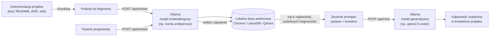
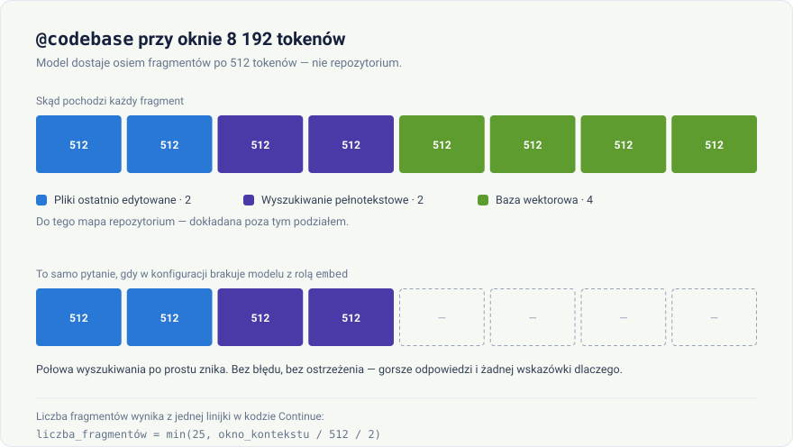

# Budowa agenta z dostępem do bazy wiedzy projektu (RAG) w oparciu o Ollama

<p align="center">
  
</p>

> Seria szkoleniowa: **Lokalni agenci AI dla programistów** — odcinek 2

> **Dla początkujących:** ten odcinek jest trochę bardziej techniczny niż pierwszy, ale nie musisz rozumieć wszystkiego za pierwszym razem. Najważniejsza rzecz do zapamiętania: **RAG to sposób, żeby model "widział" Twój projekt**, zamiast zgadywać na podstawie ogólnej wiedzy. Jeśli nie chcesz na razie pisać własnego kodu, przejdź od razu do sekcji ["Wbudowany RAG w narzędziach IDE"](#wbudowany-rag-w-narzędziach-ide-bez-własnego-pipelineu) — tam pokazujemy gotowe rozwiązanie w 5 minut, bez programowania.

## Wprowadzenie

W poprzednim odcinku uruchomiliśmy lokalne modele LLM przy pomocy Ollamy i podłączyliśmy je do edytora kodu. Model działający "z pamięci" ma jednak istotne ograniczenie: zna tylko to, czego nauczył się podczas treningu, i nie widzi Twojego konkretnego projektu, jego dokumentacji ani wewnętrznych konwencji. Rozwiązaniem tego problemu jest **RAG (Retrieval-Augmented Generation, czyli "generowanie wzbogacone o wyszukiwanie")** — technika, w której przed wygenerowaniem odpowiedzi model otrzymuje dodatkowo najbardziej trafne fragmenty z bazy wiedzy (kodu, dokumentacji, ADR-ów, wiki), pobrane na podstawie podobieństwa semantycznego do zadanego pytania.

> **Krótkie wyjaśnienie pojęć**, które pojawią się w tym artykule:
> - **Embedding** — liczbowa "odcisk palca" tekstu, dzięki któremu komputer może porównywać znaczenie zdań, a nie tylko dopasowywać identyczne słowa.
> - **Baza wektorowa** — specjalna baza danych, która przechowuje takie "odciski palców" i potrafi błyskawicznie znaleźć te najbardziej podobne do zadanego pytania.
> - **Chunking** — dzielenie długiego dokumentu na mniejsze kawałki (akapity), bo model wyszukuje trafniej w małych fragmentach niż w całym pliku naraz.

### Czy Ollama obsługuje RAG?

Krótko: **Ollama nie jest gotowym frameworkiem RAG**, ale dostarcza dwa kluczowe elementy, na których RAG się opiera — i to w pełni lokalnie, bez wysyłania kodu na zewnątrz:

1. **Modele embeddingowe** — zamieniają tekst (fragment kodu, akapit dokumentacji) na wektor liczbowy reprezentujący jego znaczenie. Ollama udostępnia je przez endpoint `/api/embed`.
2. **Modele generatywne (LLM)** — te same modele co w poprzednim odcinku (`qwen2.5-coder`, `llama3.1` itd.), które na podstawie pytania i dostarczonego kontekstu generują odpowiedź.

Brakujący element — **bazę wektorową** (do przechowywania i wyszukiwania embeddingów) oraz **logikę orkiestracji** (dzielenie dokumentów, wyszukiwanie, składanie promptu) — trzeba dodać osobno, np. przy pomocy lekkiej bazy wektorowej (Chroma, LanceDB, Qdrant) i prostego skryptu lub frameworka (LangChain, LlamaIndex). Dobra wiadomość: wszystkie te elementy mogą działać w 100% lokalnie, obok Ollamy, na tym samym komputerze.



### Dlaczego to ważne dla programisty?

- **Aktualność wiedzy** — RAG pozwala modelowi odpowiadać na podstawie *bieżącego* stanu repozytorium, a nie wiedzy sprzed miesięcy z treningu.
- **Mniej "halucynacji"** — model odpowiada w oparciu o realne fragmenty kodu/dokumentacji, a nie zgaduje na podstawie ogólnej wiedzy.
- **Prywatność** — cały indeks i baza wiedzy pozostają lokalnie, nic nie opuszcza maszyny/sieci firmowej.
- **Elastyczność** — do bazy wiedzy można dorzucić nie tylko kod, ale też dokumentację architektoniczną, zgłoszenia z trackera, notatki z code review itd.

## Wymagania wstępne

- Ollama zainstalowana i uruchomiona (patrz [odcinek 1](../01-lokalni-agenci-ai-ollama/01-lokalni-agenci-ai-ollama.md)).
- Python 3.10+ (do przykładów pipeline'u indeksowania). Na Windows, jeśli `python` lub `pip` nie są rozpoznawane, użyj `py` i `py -m pip` — instalator Pythona z Microsoft Store nie zawsze dopisuje się do `PATH`.
- Dodatkowe ~2–4 GB RAM/dysku na model embeddingowy i indeks wektorowy.
- Opcjonalnie: Docker, jeśli zdecydujesz się na bazę wektorową uruchamianą jako kontener (np. Qdrant).

## Model embeddingowy w Ollama

Do zamiany tekstu na wektory Ollama udostępnia dedykowane modele embeddingowe — nie są to modele czatu, tylko wyspecjalizowane sieci zwracające wektor liczb.

```bash
# Popularne modele embeddingowe dostępne w bibliotece Ollamy
ollama pull nomic-embed-text     # ~270 MB, dobra jakość ogólna, szybki
ollama pull mxbai-embed-large    # ~670 MB, wyższa jakość, wolniejszy
ollama pull all-minilm           # bardzo lekki, do zastosowań z ograniczonym sprzętem
```

Wywołanie API do wygenerowania embeddingu:

```bash
curl http://localhost:11434/api/embed -d '{
  "model": "nomic-embed-text",
  "input": "Funkcja calculateInvoiceTotal sumuje pozycje faktury i dolicza VAT."
}'
```

> **Windows:** tak jak w odcinku 1 — w PowerShell wpisuj `curl.exe`, nie `curl`.

Odpowiedź zawiera wektor liczb zmiennoprzecinkowych (np. 768 wymiarów dla `nomic-embed-text`), który zapisujemy w bazie wektorowej razem z oryginalnym fragmentem tekstu.

> **Uwaga:** modelu embeddingowego używa się **konsekwentnie** — ten sam model, który zaindeksował dokumenty, musi być użyty do zakodowania pytania użytkownika. Zmiana modelu embeddingowego wymaga ponownego zaindeksowania całej bazy wiedzy.

## Wybór lokalnej bazy wektorowej

| Baza wektorowa | Uruchomienie | Kiedy wybrać |
|---|---|---|
| **Chroma** | biblioteka Python (`pip install chromadb`), działa in-process lub jako serwer | Najprostszy start, dobry do jednego projektu/małych zespołów |
| **LanceDB** | biblioteka Python/Rust, zapisuje dane na dysku jako pliki | Brak potrzeby uruchamiania serwera, dobra wydajność przy dużych zbiorach |
| **Qdrant** | kontener Docker (`docker run -p 6333:6333 qdrant/qdrant`) | Gdy baza wiedzy ma być współdzielona przez zespół/wiele aplikacji |
| **pgvector** | rozszerzenie do istniejącego PostgreSQL | Gdy zespół już zarządza bazą Postgres i chce trzymać wektory obok innych danych |

Do przykładów w tym odcinku użyjemy **Chroma** — najszybszej opcji na start.

```bash
pip install chromadb ollama
```

> **Ścieżka dla początkujących:** poniższe dwie sekcje ("Budowa pipeline'u indeksowania" i "Zapytanie do bazy wiedzy") pokazują, **jak to działa "pod maską"**, budując wszystko ręcznie w Pythonie. Jeśli dopiero zaczynasz i zależy Ci na szybkim efekcie bez pisania kodu, możesz teraz przejść do sekcji ["Wbudowany RAG w narzędziach IDE"](#wbudowany-rag-w-narzędziach-ide-bez-własnego-pipelineu) i wrócić do kodu Pythona później, gdy zechcesz zrozumieć szczegóły.

## Budowa pipeline'u indeksowania

Poniższy skrypt dzieli pliki dokumentacji/kodu na fragmenty, generuje embeddingi przez Ollamę i zapisuje je w lokalnej bazie Chroma.

```python
import os
import glob
import chromadb
import ollama

client = chromadb.PersistentClient(path="./rag-index")
collection = client.get_or_create_collection("projekt-wiedza")

EMBED_MODEL = "nomic-embed-text"

def chunk_text(text: str, max_chars: int = 1200) -> list[str]:
    paragraphs = text.split("\n\n")
    chunks, current = [], ""
    for p in paragraphs:
        if len(current) + len(p) > max_chars:
            chunks.append(current.strip())
            current = p
        else:
            current += "\n\n" + p
    if current.strip():
        chunks.append(current.strip())
    return chunks

def index_file(path: str):
    with open(path, "r", encoding="utf-8", errors="ignore") as f:
        text = f.read()

    for i, chunk in enumerate(chunk_text(text)):
        embedding = ollama.embed(model=EMBED_MODEL, input=chunk)["embeddings"][0]
        doc_id = f"{path}::{i}"
        collection.upsert(
            ids=[doc_id],
            embeddings=[embedding],
            documents=[chunk],
            metadatas=[{"source": path}],
        )

if __name__ == "__main__":
    files = glob.glob("docs/**/*.md", recursive=True) + glob.glob("src/**/*.py", recursive=True)
    for path in files:
        index_file(path)
        print(f"Zaindeksowano: {path}")
```

Kluczowe elementy:

- **`chunk_text`** — dzieli dokument na mniejsze fragmenty (kontekst modeli embeddingowych jest ograniczony, a mniejsze fragmenty dają trafniejsze wyszukiwanie).
- **`collection.upsert`** — zapisuje lub **aktualizuje** istniejący wpis po identyfikatorze (`path::numer_fragmentu`), co jest kluczowe dla utrzymania bazy w aktualnym stanie (patrz sekcja poniżej).

## Zapytanie do bazy wiedzy (retrieval) i generowanie odpowiedzi

```python
import chromadb
import ollama

client = chromadb.PersistentClient(path="./rag-index")
collection = client.get_or_create_collection("projekt-wiedza")

CHAT_MODEL = "qwen2.5-coder:7b"
EMBED_MODEL = "nomic-embed-text"

def ask(question: str, top_k: int = 4) -> str:
    query_embedding = ollama.embed(model=EMBED_MODEL, input=question)["embeddings"][0]

    results = collection.query(query_embeddings=[query_embedding], n_results=top_k)
    context_chunks = results["documents"][0]
    sources = [m["source"] for m in results["metadatas"][0]]

    context = "\n\n---\n\n".join(context_chunks)

    prompt = f"""Odpowiedz na pytanie wyłącznie na podstawie poniższego kontekstu z projektu.
Jeśli odpowiedzi nie ma w kontekście, powiedz, że nie znalazłeś informacji w bazie wiedzy.

Kontekst:
{context}

Pytanie: {question}
"""

    response = ollama.chat(model=CHAT_MODEL, messages=[{"role": "user", "content": prompt}])
    answer = response["message"]["content"]
    return f"{answer}\n\nŹródła: {', '.join(sorted(set(sources)))}"

if __name__ == "__main__":
    print(ask("Jak działa funkcja calculateInvoiceTotal i gdzie jest zdefiniowana?"))
```

To jest już kompletny, minimalny agent RAG: pytanie → embedding → wyszukanie top-k fragmentów → złożenie promptu → odpowiedź modelu generatywnego z podaniem źródeł.

## Jak utrzymać bazę wiedzy aktualną

Największym ryzykiem RAG-a jest **przestarzały indeks** — jeśli baza wektorowa nie nadąża za zmianami w repozytorium, agent zacznie podawać nieaktualne informacje z fałszywą pewnością. Kilka sprawdzonych strategii:

### 1. Re-indeksowanie na podstawie zmian w plikach (mtime/hash)

Zamiast indeksować cały projekt od zera za każdym razem, sprawdzaj datę modyfikacji lub sumę kontrolną pliku i aktualizuj tylko zmienione fragmenty:

```python
import hashlib

def file_hash(path: str) -> str:
    with open(path, "rb") as f:
        return hashlib.sha256(f.read()).hexdigest()

# Przechowuj mapę {path: hash} np. w pliku JSON lub w metadanych kolekcji Chroma
# i reindeksuj tylko pliki, których hash się zmienił.
```

### 2. Automatyczne indeksowanie przy commitach (git hook)

Dodaj `post-commit` lub `post-merge` hook w `.git/hooks/`, który uruchamia skrypt indeksujący po każdej zmianie w gałęzi głównej:

```bash
#!/bin/sh
# .git/hooks/post-merge
python scripts/index_knowledge_base.py --changed-only
```

> **Windows:** ten plik działa także tutaj — Git for Windows uruchamia hooki własnym Bashem, więc nagłówek `#!/bin/sh` jest w porządku. Plik zapisz **bez rozszerzenia** (`post-merge`, nie `post-merge.sh`) i z zakończeniami linii LF.

### 3. Harmonogram (cron / zadanie CI)

Dla większych repozytoriów lub gdy baza wiedzy obejmuje też zewnętrzne źródła (wiki, tracker zadań), warto uruchamiać pełne re-indeksowanie cyklicznie, np. co noc, jako zadanie w CI/CD lub `cron`:

```bash
# crontab -e
0 2 * * * cd /ścieżka/do/projektu && python scripts/index_knowledge_base.py
```

> **Windows:** odpowiednikiem `cron` jest **Harmonogram zadań** (Task Scheduler). Z wiersza poleceń to samo zadanie założysz jednolinijkowcem:
>
> ```powershell
> schtasks /create /tn "Reindeks bazy wiedzy" /tr "py C:\projekty\moj-projekt\scripts\index_knowledge_base.py" /sc daily /st 02:00
> ```

### 4. Wersjonowanie indeksu razem z gałęzią

Jeśli zespół pracuje na wielu długożyjących gałęziach z różną architekturą, rozważ osobną kolekcję Chroma per gałąź (`projekt-wiedza-main`, `projekt-wiedza-feature-x`), aby uniknąć mieszania kontekstu z nieaktualnych wersji kodu.

### 5. Oznaczanie źródła i daty w odpowiedzi

Jak w przykładzie `ask()` powyżej — zawsze zwracaj programiście listę źródeł (i najlepiej datę ostatniej indeksacji), aby mógł ocenić wiarygodność odpowiedzi i w razie wątpliwości zajrzeć do oryginalnego pliku.

> **Zasada praktyczna:** RAG nie zastępuje przeglądania kodu, ale skraca czas potrzebny na znalezienie właściwego miejsca do sprawdzenia. Traktuj odpowiedzi agenta jako punkt wyjścia, nie ostateczne źródło prawdy.

## Wbudowany RAG w narzędziach IDE (bez własnego pipeline'u)

Nie zawsze trzeba pisać własny pipeline — część wtyczek AI ma **wbudowaną** obsługę RAG dla kodu projektu, korzystając z lokalnych modeli embeddingowych, w tym z Ollamy.

### Continue — kontekst `@codebase` i `@docs`

Continue automatycznie indeksuje otwarty projekt i pozwala odwołać się do niego w czacie poleceniem `@codebase`, korzystając z lokalnego modelu embeddingowego skonfigurowanego w `config.yaml`:

```yaml
name: Lokalny asystent
version: 1.0.0
schema: v1

models:
  - name: Qwen Coder 7B
    provider: ollama
    model: qwen2.5-coder:7b
    apiBase: http://localhost:11434
    roles: [chat, edit, apply]

  - name: Nomic Embed (indeksowanie projektu)
    provider: ollama
    model: nomic-embed-text
    apiBase: http://localhost:11434
    roles: [embed]

context:
  - provider: codebase
  - provider: docs
```

Model embeddingowy nie ma w `config.yaml` osobnego klucza — jest zwykłym wpisem na liście `models`, tyle że z rolą `embed` (starsze poradniki pokazują tu `embeddingsProvider` ze zdezaktualizowanego formatu `config.json`; patrz uwaga w [odcinku 1](../01-lokalni-agenci-ai-ollama/01-lokalni-agenci-ai-ollama.md#jak-dodać-zainstalowane-modele-do-konfiguracji-ide)).

Po zapisaniu konfiguracji w panelu czatu można zapytać np. `@codebase Jak działa proces generowania faktury?` — Continue wyszuka fragmenty repozytorium (indeksowane lokalnie, przyrostowo, w tle) i doda je jako kontekst do zapytania.

> Provider `docs` pozwala dodatkowo zaindeksować zewnętrzną dokumentację (np. dokumentację frameworka) podając jej URL w ustawieniach — przydatne, gdy baza wiedzy ma wykraczać poza sam kod repozytorium.

### Co `@codebase` naprawdę wysyła do modelu

Nazwa sugeruje, że model dostaje repozytorium. Nie dostaje — i to jest najczęstsze nieporozumienie wokół tej funkcji. `@codebase` to zwykły RAG: Continue wyszukuje kilka fragmentów kodu i wkleja je do promptu. Model widzi tylko te fragmenty.

Ile ich jest, wynika z jednej linijki w kodzie Continue:

```text
liczba fragmentów = min(25, okno_kontekstu / 512 / 2)
```

Czyli **`@codebase` zajmuje połowę okna kontekstu**, licząc 512 tokenów na fragment, nie więcej niż 25 fragmentów:

| Okno kontekstu | Fragmentów | Zajęte przez `@codebase` |
|---|---|---|
| 4 096 | 4 | ~2 000 tokenów |
| 8 192 | 8 | ~4 000 tokenów |
| 16 384 | 16 | ~8 000 tokenów |
| 32 768 i więcej | 25 (limit) | ~12 800 tokenów |

Druga niespodzianka: fragmenty nie pochodzą wyłącznie z bazy wektorowej. Continue miesza cztery źródła w sztywnych proporcjach:

| Źródło | Udział |
|---|---|
| Pliki ostatnio edytowane | 25% |
| Wyszukiwanie pełnotekstowe (trigramy) | 25% |
| Baza wektorowa (embeddingi) | 50% |
| Mapa repozytorium | dodatkowo, poza podziałem |

Wynika stąd rzecz, która potrafi kosztować godzinę szukania: **`@codebase` działa również bez modelu embeddingowego**. Jeśli zapomnisz o wpisie z rolą `embed`, Continue po prostu pomija połowę wyszukiwania i odpowiada dalej — bez błędu, bez ostrzeżenia. Dostajesz gorsze odpowiedzi i żadnej wskazówki dlaczego. W kodzie jest nawet ostrzeżenie na ten temat, świadomie zakomentowane.



Praktyczny wniosek: jeśli `@codebase` daje słabe wyniki, najpierw sprawdź `ollama list`, czy model embeddingowy w ogóle jest pobrany, a potem czy ma w `config.yaml` rolę `embed`.

### Continue nadpisuje Twoje ustawienie okna kontekstu

Przy każdym żądaniu Continue wysyła do Ollamy własne `num_ctx`. Oznacza to, że zmienna `OLLAMA_CONTEXT_LENGTH` z [odcinka 1](../01-lokalni-agenci-ai-ollama/01-lokalni-agenci-ai-ollama.md#okno-kontekstu--ile-model-naprawdę-pamięta) **nie ma znaczenia dla ruchu z Continue** — decyduje konfiguracja wtyczki, w tej kolejności:

1. `contextLength` w `defaultCompletionOptions` modelu — jeśli ustawione, wygrywa ze wszystkim.
2. `num_ctx` zapisany w Modelfile modelu — Continue odczytuje go z `/api/show`.
3. **8192** — wartość domyślna Continue dla Ollamy, gdy nie ma ani jednego, ani drugiego.

Punkt trzeci dotyczy każdego, kto niczego nie ustawił — i tu liczby przestają się spinać. Prompt przycinany jest bowiem dwa razy, przez dwa niezależne mechanizmy:

**Continue** przycina go do `contextLength − maxTokens`, funkcją o wymownej nazwie `pruneRawPromptFromTop` — czyli **od góry, od najstarszej części**. Domyślny `maxTokens` to 4096, więc przy oknie 8192 zostaje 4096 tokenów.

**Ollama** przycina niezależnie, do **połowy `num_ctx`** — jak zmierzyliśmy w [odcinku 1](../01-lokalni-agenci-ai-ollama/01-lokalni-agenci-ai-ollama.md#na-prompt-przypada-połowa-okna). Przy oknie 8192 to też 4096, ale ta zbieżność jest przypadkowa: gdybyś zmniejszył `maxTokens` do 512, Continue puściłoby prompt o długości 7680, a Ollama i tak przyjęłaby 4096 i wycięła resztę bez słowa.

Zapamiętaj tę drugą część, bo psuje najbardziej naturalny odruch: **zmniejszanie `maxTokens`, żeby zrobić miejsce na prompt, nie działa.** Ollama nie bierze tego parametru pod uwagę przy dzieleniu okna.

Realny budżet promptu przy ustawieniach domyślnych to więc **4096 tokenów**, a samo `@codebase` chce ich około 4000. Na instrukcję systemową, historię rozmowy i Twoje pytanie nie zostaje praktycznie nic. To jest najczęstsza przyczyna sytuacji, w której `@codebase` „przestaje słuchać instrukcji": instrukcja nadal jest w konfiguracji, tylko nie dociera do modelu.

Skoro jedynym parametrem, który realnie zwiększa miejsce na prompt, jest okno — to jego trzeba ruszyć:

```yaml
models:
  - name: Qwen Coder 7B
    provider: ollama
    model: qwen2.5-coder:7b
    apiBase: http://localhost:11434
    roles: [chat, edit, apply]
    defaultCompletionOptions:
      contextLength: 16384
```

Bilans po tej zmianie: okno 16384 daje 8192 tokeny na prompt, `@codebase` weźmie z tego 16 fragmentów (~8000 tokenów)… czyli znowu prawie wszystko. Dlatego przy dużym oknie warto dodatkowo ograniczyć samo wyszukiwanie:

```yaml
context:
  - provider: codebase
    params:
      nFinal: 8
```

Osiem fragmentów przy oknie 16384 zostawia połowę budżetu promptu na instrukcję systemową, narzędzia i rozmowę. To jest ustawienie, od którego warto zacząć — i pierwsze, które warto zmienić, gdy odpowiedzi wyglądają, jakby model nie widział czegoś oczywistego.

Po zmianie sprawdź `ollama ps`: w kolumnie `CONTEXT` powinno pojawić się 16384, a w kolumnie `PROCESSOR` nadal `100% GPU`. Jeśli pojawił się udział CPU, okno jest za duże dla Twojej karty i cała praca właśnie zwolniła.

### Ćwiczenie: zmierz, ile wysyła Twoje `@codebase`

Wszystkie liczby powyżej pochodzą z jednej maszyny i jednej konfiguracji. U Ciebie wyjdą inne — inny model, inne repozytorium, inne ustawienia. To jedyne ćwiczenie w serii, w którym nie przepisujesz kodu, tylko mierzysz własne środowisko.

Skrypt [`zmierz_codebase.py`](zmierz_codebase.py) staje między Continue a Ollamą i po każdym zapytaniu wypisuje, co naprawdę poszło. Nie wymaga żadnych bibliotek poza standardową i niczego nie zmienia w samej Ollamie.

**1.** Uruchom go w osobnym oknie terminala (na Windowsie `py` zamiast `python3`):

```bash
python3 zmierz_codebase.py
```

**2.** W `config.yaml` podmień adres modelu czatu na port skryptu:

```yaml
    apiBase: http://localhost:11435
```

**3.** W panelu czatu zadaj pytanie zaczynające się od `@codebase` — najlepiej takie, które naprawdę wymaga przejrzenia projektu, np. `@codebase Gdzie walidowane są dane wejściowe formularza?`

**4.** Wróć do terminala. Zobaczysz mniej więcej to:

```text
==============================================================
model:                     qwen2.5-coder:7b
wiadomości w rozmowie:     2
prompt:                    19043 znaków, czyli około 7617 tokenów
tokeny policzone przez Ollamę: 4098
num_ctx narzucony przez Continue: 8192
num_predict (limit odpowiedzi): 4096
budżet promptu (połowa num_ctx): 4096
wykorzystanie budżetu:     186%

>>> Prompt nie mieści się w budżecie.
>>> Został przycięty od najstarszej strony,
>>> czyli od instrukcji systemowej. Bez błędu.
==============================================================
```

Najważniejsze są dwie liczby obok siebie: ile tokenów wysłano i ile Ollama faktycznie policzyła. Jeśli druga jest wyraźnie mniejsza, reszta nie dotarła do modelu — a odpowiedź, którą właśnie dostałeś w edytorze, powstała bez niej.

**5.** Teraz zmień `contextLength` na 16384, zrestartuj Continue i powtórz to samo pytanie. Porównaj oba raporty.

Na koniec skasuj linię z `apiBase: http://localhost:11435`, żeby Continue wróciło do rozmowy z Ollamą bezpośrednio.

> **Uwaga o szacowaniu:** skrypt przelicza znaki na tokeny przez stałą 2,5, bo Ollama nie udostępnia endpointu tokenizacji (`/api/tokenize` zwraca 404). Skąd akurat 2,5 i dlaczego popularne „4 znaki na token" tu nie działa, wyjaśniamy w [odcinku 1, w sekcji o tokenach](../01-lokalni-agenci-ai-ollama/01-lokalni-agenci-ai-ollama.md#token--jednostka-w-której-liczy-się-wszystko). Dla mieszanki kodu i polszczyzny pomyłka rzędu 10–20% jest normalna i widać ją, porównując szacunek z `prompt_eval_count` w raporcie. Do stwierdzenia „prompt jest dwa razy za duży" ta dokładność w zupełności wystarcza.

## Dobre praktyki

1. **Dziel treść na sensowne fragmenty** — cały plik na raz to zbyt duży kontekst; pojedyncze zdanie to za mało. Fragmenty 500–1500 znaków to dobry punkt startowy.
2. **Zachowaj spójność modelu embeddingowego** — nie mieszaj wektorów z różnych modeli embeddingowych w jednej kolekcji.
3. **Aktualizuj indeks przyrostowo** — pełne re-indeksowanie dużego repozytorium może być kosztowne; aktualizuj tylko zmienione pliki.
4. **Zwracaj źródła** — zawsze pokazuj, z jakiego pliku/dokumentu pochodzi kontekst użyty do odpowiedzi.
5. **Testuj jakość wyszukiwania osobno od jakości generowania** — jeśli odpowiedzi są słabe, sprawdź najpierw, czy `top_k` wyników z bazy wektorowej faktycznie jest trafnych, zanim obwinisz model generatywny.

## Podsumowanie

Ollama nie jest samodzielnym frameworkiem RAG, ale dostarcza wszystkie potrzebne "klocki" — lokalne modele embeddingowe i generatywne — na bazie których można zbudować w pełni prywatny agent z dostępem do aktualnej wiedzy o projekcie. Pokazaliśmy zarówno własny, minimalny pipeline (Chroma + Ollama), jak i gotową, wbudowaną obsługę RAG w Continue. Kluczem do wartościowego agenta jest nie tylko sama architektura, ale też dyscyplina utrzymywania indeksu w aktualnym stanie.

## Co dalej?

W kolejnym odcinku serii zajmiemy się pamięcią długoterminową agenta — jak zapamiętywać kontekst rozmów i decyzji projektowych między sesjami, nadal w pełni lokalnie.

---

*Poziom trudności: podstawowy, z opcjonalnymi fragmentami dla chętnych (kod Python) · Czas czytania: ~15 minut*
