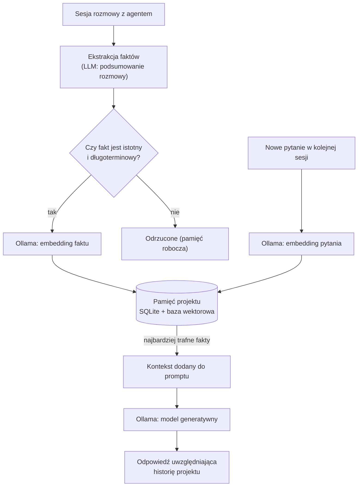

# Pamięć długoterminowa agenta AI w kontekście projektu (Ollama)

<p align="center">
  
</p>

> Seria szkoleniowa: **Lokalni agenci AI dla programistów** — odcinek 3

> **Dla początkujących:** jeśli dopiero zaczynasz, nie musisz od razu budować własnej bazy pamięci w kodzie. Najprostszy i najszybszy start to zwykły **plik Markdown z zasadami projektu** (opisany w sekcji ["Pamięć proceduralna jako plik reguł w repozytorium"](#pamięć-proceduralna-jako-plik-reguł-w-repozytorium)) — zajmuje 5 minut i od razu daje dużą poprawę jakości odpowiedzi agenta. Bardziej rozbudowany, programistyczny mechanizm pamięci pokazujemy w dalszej części dla osób, które chcą pójść o krok dalej.

## Wprowadzenie

W [odcinku 1](../01-lokalni-agenci-ai-ollama/01-lokalni-agenci-ai-ollama.md) uruchomiliśmy lokalny model, a w [odcinku 2](../02-lokalny-rag-baza-wiedzy/02-lokalny-rag-baza-wiedzy.md) daliśmy mu dostęp do statycznej bazy wiedzy projektu (kod, dokumentacja) przez RAG. Tym razem zajmiemy się czymś innym: **pamięcią długoterminową** — zdolnością agenta do zapamiętywania faktów, decyzji i ustaleń **z bieżącej pracy nad projektem**, między osobnymi sesjami rozmowy, i przywoływania ich, gdy są potrzebne.

### Czym różni się pamięć długoterminowa od RAG?

| | RAG (odcinek 2) | Pamięć długoterminowa (ten odcinek) |
|---|---|---|
| Źródło treści | Istniejące pliki: kod, dokumentacja, README | Fakty i decyzje **generowane w trakcie pracy** z agentem |
| Częstość aktualizacji | Re-indeksowanie po zmianie plików | Ciągły zapis po każdej istotnej rozmowie/decyzji |
| Charakter danych | Względnie statyczna wiedza "co jest" | Dynamiczna wiedza "co ustaliliśmy", "dlaczego tak zrobiliśmy" |
| Przykład | "Jak działa funkcja `calculateInvoiceTotal`?" | "Dlaczego w zeszłym tygodniu zdecydowaliśmy się na wzorzec Repository zamiast bezpośrednich zapytań SQL?" |

W praktyce oba mechanizmy się uzupełniają i często współdzielą tę samą infrastrukturę (baza wektorowa + model embeddingowy z Ollamy) — różni je jedynie **co i kiedy trafia do indeksu**.

### Rodzaje pamięci agenta

- **Pamięć robocza (kontekst okna)** — to, co model "widzi" w danym zapytaniu; ograniczona rozmiarem okna kontekstu modelu.
- **Pamięć epizodyczna** — historia konkretnych rozmów/sesji (kto o co pytał, co ustalono).
- **Pamięć semantyczna** — wydestylowane fakty i decyzje, niezależne od tego, w której rozmowie padły (np. "projekt używa PostgreSQL 16 i wzorca CQRS").
- **Pamięć proceduralna** — utrwalone zasady/konwencje działania agenta w danym projekcie (np. "zawsze pisz testy jednostkowe przed implementacją").

Ten odcinek skupia się głównie na pamięci **semantycznej** i **proceduralnej**, bo to one najbardziej podnoszą jakość pracy agenta w konkretnym projekcie.

> **Krótkie wyjaśnienie pojęć** używanych dalej: **fakt** to jedno zdanie warte zapamiętania (np. "projekt używa PostgreSQL"), **konsolidacja** to porządkowanie i łączenie takich faktów, żeby baza nie robła się bałaganem, a **embedding** (opisany szerzej w [odcinku 2](../02-lokalny-rag-baza-wiedzy/02-lokalny-rag-baza-wiedzy.md)) to liczbowa reprezentacja tekstu używana do wyszukiwania podobnych faktów.



## Wymagania wstępne

- Ollama z modelem czatu (`qwen2.5-coder:7b` lub podobny) oraz modelem embeddingowym (`nomic-embed-text`) — patrz odcinki 1–2.
- Python 3.10+ z bibliotekami `chromadb` i `ollama` (zainstalowanymi w odcinku 2).
- Wydzielony katalog **w repozytorium projektu** na pamięć agenta, np. `.agent-memory/` — dzięki temu pamięć jest przypisana do konkretnego projektu, a nie globalnie do użytkownika.

## Pamięć przypisana do projektu, nie do użytkownika

Kluczowa decyzja projektowa: pamięć długoterminowa powinna być **scoped per-projekt** (np. po ścieżce repozytorium lub adresie `git remote`), a nie jedną globalną bazą dla wszystkich projektów na komputerze. W przeciwnym razie agent zacznie mieszać ustalenia z różnych, niepowiązanych projektów.

```python
import subprocess
import hashlib
import os

def project_id(repo_path: str = ".") -> str:
    """Zwraca stabilny identyfikator projektu na podstawie zdalnego URL-a git (lub ścieżki, jeśli brak zdalnego)."""
    try:
        remote = subprocess.check_output(
            ["git", "-C", repo_path, "remote", "get-url", "origin"],
            stderr=subprocess.DEVNULL,
        ).decode().strip()
    except subprocess.CalledProcessError:
        remote = os.path.abspath(repo_path)
    return hashlib.sha1(remote.encode()).hexdigest()[:12]
```

Każdy projekt dostaje swoją kolekcję w bazie wektorowej (np. `pamiec-{project_id}`), a katalog `.agent-memory/` w repozytorium przechowuje pliki pomocnicze (patrz dalej) — dzięki temu pamięć **wędruje razem z repozytorium** (jeśli dodana do kontroli wersji) lub zostaje lokalnie (jeśli dodana do `.gitignore`, gdy zawiera treści, których nie chcemy commitować).

> **Decyzja zespołowa:** czy pamięć agenta ma być współdzielona przez zespół (commitowana do repo) czy prywatna dla każdego programisty (`.gitignore`)? Współdzielona pamięć = spójne decyzje dla całego zespołu, ale wymaga przeglądu jak każda inna zmiana w repo.

## Implementacja: menedżer pamięci projektu

> **Ta sekcja jest opcjonalna** i przeznaczona dla osób, które chcą zbudować własny mechanizm pamięci w kodzie (np. jako część większego, autorskiego agenta). Jeśli wystarcza Ci plik reguł z poprzedniej sekcji, możesz spokojnie przejść od razu do ["Dobre praktyki"](#dobre-praktyki).

Poniższy przykład rozszerza pipeline z odcinka 2 o zapis i odczyt **dynamicznych faktów**, z prostym mechanizmem ważności (recency) i ekstrakcją faktów przez sam model LLM.

```python
import time
import json
import chromadb
import ollama

EMBED_MODEL = "nomic-embed-text"
CHAT_MODEL = "qwen2.5-coder:7b"

class ProjectMemory:
    def __init__(self, project_id: str, path: str = "./.agent-memory/vector-store"):
        self.client = chromadb.PersistentClient(path=path)
        self.collection = self.client.get_or_create_collection(f"pamiec-{project_id}")

    def remember(self, fact: str, category: str = "decyzja", importance: int = 5):
        """Zapisuje fakt w pamięci długoterminowej wraz z metadanymi."""
        embedding = ollama.embed(model=EMBED_MODEL, input=fact)["embeddings"][0]
        fact_id = f"fact-{int(time.time() * 1000)}"
        self.collection.upsert(
            ids=[fact_id],
            embeddings=[embedding],
            documents=[fact],
            metadatas=[{
                "category": category,       # np. "decyzja", "konwencja", "preferencja", "problem"
                "importance": importance,   # 1-10, wpływa na priorytet przy przywoływaniu
                "timestamp": time.time(),
            }],
        )
        return fact_id

    def recall(self, query: str, top_k: int = 5) -> list[str]:
        """Zwraca najbardziej trafne zapamiętane fakty dla danego zapytania."""
        embedding = ollama.embed(model=EMBED_MODEL, input=query)["embeddings"][0]
        results = self.collection.query(query_embeddings=[embedding], n_results=top_k)
        return results["documents"][0] if results["documents"] else []

    def extract_facts_from_conversation(self, conversation: str) -> list[dict]:
        """Wykorzystuje LLM do wyodrębnienia trwałych faktów z transkryptu rozmowy."""
        prompt = f"""Przeanalizuj poniższą rozmowę programisty z asystentem AI.
Wypisz wyłącznie trwałe fakty/decyzje/konwencje warte zapamiętania na przyszłość
(pomiń pytania czysto techniczne bez długoterminowego znaczenia).
Zwróć wynik jako listę JSON obiektów: {{"fact": "...", "category": "...", "importance": 1-10}}.

Rozmowa:
{conversation}
"""
        response = ollama.chat(model=CHAT_MODEL, messages=[{"role": "user", "content": prompt}])
        try:
            return json.loads(response["message"]["content"])
        except json.JSONDecodeError:
            return []

    def consolidate_session(self, conversation: str):
        """Wyodrębnia i zapisuje fakty z zakończonej sesji rozmowy."""
        facts = self.extract_facts_from_conversation(conversation)
        for f in facts:
            self.remember(f["fact"], category=f.get("category", "decyzja"), importance=f.get("importance", 5))
        return facts
```

Przykład użycia — na końcu sesji roboczej agent automatycznie zapisuje ustalenia:

```python
memory = ProjectMemory(project_id="a1b2c3d4e5f6")

conversation = """
Programista: Chcemy wprowadzić wzorzec Repository zamiast bezpośrednich zapytań SQL w kontrolerach.
Asystent: Dobry pomysł, ułatwi to testowanie jednostkowe.
Programista: Ustalmy, że wszystkie nowe repozytoria implementują interfejs IRepository<T>.
"""

facts = memory.consolidate_session(conversation)
print(facts)
# [{"fact": "Projekt używa wzorca Repository zamiast bezpośrednich zapytań SQL w kontrolerach.", "category": "konwencja", "importance": 8},
#  {"fact": "Wszystkie nowe repozytoria implementują interfejs IRepository<T>.", "category": "konwencja", "importance": 9}]

# W kolejnej, zupełnie nowej sesji:
context = memory.recall("Jak powinienem zaimplementować dostęp do danych dla nowego modułu Zamówienia?")
print(context)
# ["Projekt używa wzorca Repository zamiast bezpośrednich zapytań SQL w kontrolerach.",
#  "Wszystkie nowe repozytoria implementują interfejs IRepository<T>."]
```

## Konsolidacja i "zapominanie" — dlaczego to konieczne

Pamięć, która tylko rośnie, z czasem zaczyna szkodzić: rosną koszty wyszukiwania, pojawiają się sprzeczne lub nieaktualne fakty (np. "projekt używa REST" zapisane przed migracją na GraphQL). Warto wprowadzić okresową **konsolidację pamięci**:

1. **Deduplikacja** — okresowo (np. raz w tygodniu) poproś LLM o porównanie nowych faktów z istniejącymi i połączenie/nadpisanie duplikatów.
2. **Wygaszanie nieaktualnych faktów** — jeśli nowy fakt jest sprzeczny ze starym (np. zmiana architektury), oznacz stary jako nieaktualny zamiast go usuwać (zachowaj historię decyzji).
3. **Priorytetyzacja przy odczycie** — łącz podobieństwo semantyczne (`recall`) z polami `importance` i `timestamp`, aby świeższe i ważniejsze fakty miały pierwszeństwo:

```python
def recall_weighted(self, query: str, top_k: int = 5, recency_days: int = 90) -> list[str]:
    embedding = ollama.embed(model=EMBED_MODEL, input=query)["embeddings"][0]
    results = self.collection.query(
        query_embeddings=[embedding],
        n_results=top_k * 3,  # pobierz więcej kandydatów, przefiltruj poniżej
        include=["documents", "metadatas", "distances"],
    )
    scored = []
    now = time.time()
    for doc, meta, dist in zip(results["documents"][0], results["metadatas"][0], results["distances"][0]):
        age_days = (now - meta["timestamp"]) / 86400
        recency_penalty = max(0, age_days / recency_days)
        score = (1 - dist) * meta.get("importance", 5) / 10 - recency_penalty * 0.2
        scored.append((score, doc))
    scored.sort(key=lambda x: x[0], reverse=True)
    return [doc for _, doc in scored[:top_k]]
```

## Pamięć proceduralna jako plik reguł w repozytorium

Nie każdy fakt musi trafiać do bazy wektorowej. Ustalenia o charakterze **stałych zasad pracy** (konwencje kodowania, preferowane wzorce, rzeczy, o które agent ma zawsze pytać) najlepiej trzymać jako **czytelny dla człowieka plik Markdown w repozytorium** — analogicznie do plików `AGENTS.md` / `copilot-instructions.md` znanych z narzędzi AI dla programistów. Taki plik jest zawsze w pełni dołączany do kontekstu (bez potrzeby wyszukiwania semantycznego) i łatwo go code-review'ować jak każdą inną zmianę:

```markdown
<!-- .agent-memory/project-rules.md -->
# Zasady pracy agenta AI dla tego projektu

- Nowe repozytoria danych implementują interfejs `IRepository<T>` (ustalone 2026-08-15).
- Testy jednostkowe pisane przed implementacją (TDD) dla modułu płatności.
- Nie proponuj bibliotek wymagających płatnej licencji bez wcześniejszego potwierdzenia.
- Baza danych: PostgreSQL 16, migracje przez EF Core.
```

W Continue plik reguł można podpiąć w `config.yaml`, aby był automatycznie dołączany do każdego zapytania:

```yaml
rules:
  - .agent-memory/project-rules.md
```

**Podział obowiązków między oba mechanizmy:**

| Mechanizm | Kiedy używać |
|---|---|
| Plik reguł (Markdown, zawsze w kontekście) | Stałe, rzadko zmieniane zasady — kilka/kilkanaście punktów |
| Baza wektorowa (`ProjectMemory`, wyszukiwanie na żądanie) | Rosnąca liczba faktów historycznych, które nie zmieszczą się w każdym prompcie |

## Bezpieczeństwo i prywatność pamięci

- **Nie zapisuj sekretów** — menedżer pamięci nie powinien nigdy zapamiętywać haseł, kluczy API ani tokenów, nawet jeśli pojawiły się w rozmowie przypadkiem. Warto dodać prosty filtr odrzucający fragmenty pasujące do wzorców sekretów przed zapisem.
- **Kontroluj, co trafia do repozytorium** — jeśli plik `project-rules.md` lub baza `.agent-memory/` mają być współdzielone przez zespół, upewnij się, że nie zawierają danych osobowych ani wrażliwych informacji biznesowych.
- **Cała pamięć pozostaje lokalna** — ponieważ zarówno embeddingi, jak i ekstrakcja faktów odbywają się przez lokalną Ollamę, żadne dane nie opuszczają maszyny/sieci firmowej — to jedna z głównych przewag tego podejścia nad rozwiązaniami chmurowymi.

## Dobre praktyki

1. **Jedna pamięć = jeden projekt** — nie mieszaj kontekstu między niepowiązanymi repozytoriami.
2. **Rozdzielaj fakty stałe (plik reguł) od zmiennych (baza wektorowa)** — nie każda decyzja zasługuje na miejsce w pliku reguł dołączanym do każdego promptu.
3. **Konsoliduj regularnie** — zaplanuj cykliczne zadanie deduplikacji i przeglądu nieaktualnych faktów, tak jak porządkowanie zaległości technicznych.
4. **Zawsze ujawniaj przywołane fakty** — pokazuj programiście, jakie zapamiętane informacje wpłynęły na odpowiedź agenta, żeby mógł je zweryfikować lub skorygować.
5. **Testuj jakość ekstrakcji faktów** — model odpowiedzialny za wyciąganie faktów z rozmowy (`extract_facts_from_conversation`) warto od czasu do czasu zweryfikować ręcznie, szczególnie po zmianie modelu.

## Podsumowanie

Pamięć długoterminowa zamienia lokalnego agenta z "modelu, który raz na sesję dostaje kontekst" w asystenta, który **uczy się razem z projektem** — pamięta podjęte decyzje architektoniczne, ustalone konwencje i wcześniejsze problemy. W tym odcinku zbudowaliśmy prosty, w pełni lokalny mechanizm oparty na Ollamie (embeddingi + ekstrakcja faktów) połączony z bazą wektorową scoped per-projekt, a także pokazaliśmy, kiedy lepiej sprawdzi się prosty plik reguł zamiast wyszukiwania semantycznego.

## Co dalej?

W kolejnym odcinku serii połączymy wszystkie dotychczasowe elementy (tool calling, RAG, pamięć długoterminowa) w jednego, spójnego agenta programistycznego działającego w pętli wieloetapowej (multi-step), zdolnego do samodzielnego planowania kolejnych kroków pracy nad zadaniem.

---

*Poziom trudności: podstawowy (plik reguł) do zaawansowanego (własny mechanizm pamięci) · Czas czytania: ~15 minut*
