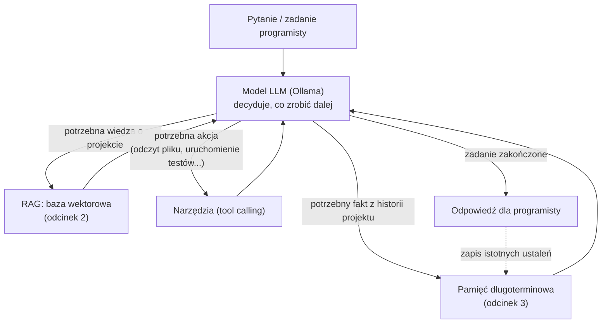

# Kompletny agent programisty: łączymy Ollama, narzędzia, RAG i pamięć

<p align="center">
  
</p>

> Seria szkoleniowa: **Lokalni agenci AI dla programistów** — odcinek 4

> **Dla początkujących:** to odcinek podsumowujący całą serię. Jeśli czytasz go jako pierwszy — najpierw zajrzyj do [odcinka 1](../01-lokalni-agenci-ai-ollama/01-lokalni-agenci-ai-ollama.md) (instalacja Ollamy), [odcinka 2](../02-lokalny-rag-baza-wiedzy/02-lokalny-rag-baza-wiedzy.md) (baza wiedzy projektu) i [odcinka 3](../03-pamiec-dlugoterminowa-agenta/03-pamiec-dlugoterminowa-agenta.md) (pamięć długoterminowa). Tutaj pokazujemy, jak te elementy współpracują ze sobą jako jedna całość — oraz najprostszą ścieżkę, by zacząć **bez pisania kodu**.

## Wprowadzenie i podsumowanie serii

W poprzednich trzech odcinkach zbudowaliśmy krok po kroku fundamenty lokalnego agenta AI:

1. **Odcinek 1** — uruchomiliśmy Ollamę, dobraliśmy model do sprzętu i języka programowania, podłączyliśmy ją do VS Code, Rider i Android Studio.
2. **Odcinek 2** — daliśmy agentowi dostęp do wiedzy o projekcie (RAG): kodu, dokumentacji, plików README.
3. **Odcinek 3** — nauczyliśmy agenta zapamiętywać decyzje i konwencje projektowe między sesjami (pamięć długoterminowa).

**Agent** w praktyce to nic innego jak model LLM osadzony w pętli: *otrzymuje zadanie → w razie potrzeby sięga po wiedzę i pamięć → w razie potrzeby wykonuje akcję (narzędzie) → zwraca wynik → ewentualnie zapamiętuje coś na przyszłość*. W tym odcinku spinamy to wszystko w jedną, spójną całość.



## Dwie ścieżki: gotowe narzędzie vs własny kod

Zanim przejdziemy do kodu, ważne rozróżnienie — **nie musisz pisać własnego agenta**, żeby korzystać z większości opisanych tu możliwości.

### Ścieżka 1 (polecana dla większości programistów): gotowe wtyczki

Narzędzia takie jak **Continue**, **Cline** czy **ProxyAI** (opisane w odcinku 1) łączą w sobie już prawie wszystko:

- tool calling — wbudowane narzędzia do czytania/edycji plików, uruchamiania poleceń,
- RAG dla kodu projektu — `@codebase`, `@docs` (odcinek 2),
- pamięć — plik reguł `rules.md` w repozytorium (opisany w odcinku 3), a niektóre narzędzia dodają też pamięć sesji.

**Checklist szybkiego startu (5–10 minut, bez kodowania):**

- [ ] Ollama zainstalowana i uruchomiona (odcinek 1).
- [ ] Pobrany model czatu (`ollama pull qwen2.5-coder:7b`) i model embeddingowy (`ollama pull nomic-embed-text`).
- [ ] Wtyczka Continue/Cline zainstalowana w IDE, skonfigurowana na `http://localhost:11434`.
- [ ] Dodany plik reguł projektu (`rules.md` w repozytorium — Continue wczytuje go sam, patrz odcinek 3).
- [ ] Włączony kontekst `@codebase` do pytań o istniejący kod.

Dla wielu zespołów to w zupełności wystarczający, w pełni lokalny "agent programisty" — bez pisania jednej linijki kodu integracyjnego.

### Ścieżka 2 (dla chcących zrozumieć/rozbudować mechanizm): własny agent w kodzie

Jeśli chcesz zbudować **własnego, niestandardowego agenta** (np. zintegrowanego z wewnętrznym systemem firmy, botem na Slacku, czy pipeline'em CI), poniżej pokazujemy, jak połączyć wszystkie trzy mechanizmy z poprzednich odcinków w jednej pętli Python.

## Budowa własnego agenta krok po kroku

### 1. Definicja narzędzi (tool calling)

Zaczynamy od prostych narzędzi, które agent może wywołać — tak jak w odcinku 1, ale tym razem dodajemy też narzędzia sięgające po RAG i pamięć z odcinków 2–3.

```python
import subprocess

def read_file_tool(path: str) -> str:
    with open(path, "r", encoding="utf-8", errors="ignore") as f:
        return f.read()

def run_tests_tool(path: str = ".") -> str:
    result = subprocess.run(["pytest", path, "-q"], capture_output=True, text=True)
    return result.stdout[-2000:] + result.stderr[-1000:]

TOOLS_SCHEMA = [
    {
        "type": "function",
        "function": {
            "name": "read_file",
            "description": "Odczytuje zawartość pliku z projektu",
            "parameters": {
                "type": "object",
                "properties": {"path": {"type": "string"}},
                "required": ["path"],
            },
        },
    },
    {
        "type": "function",
        "function": {
            "name": "run_tests",
            "description": "Uruchamia testy jednostkowe w podanym katalogu",
            "parameters": {
                "type": "object",
                "properties": {"path": {"type": "string"}},
            },
        },
    },
]

TOOL_IMPLEMENTATIONS = {
    "read_file": read_file_tool,
    "run_tests": run_tests_tool,
}
```

> **Uwaga bezpieczeństwa:** narzędzia takie jak `run_tests` czy jakiekolwiek wykonujące polecenia systemowe powinny działać na **ograniczonych uprawnieniach** i, jeśli to możliwe, w piaskownicy (kontener, osobny użytkownik systemowy). Nigdy nie udostępniaj agentowi narzędzia do dowolnego wykonania poleceń shell (`os.system(user_input)`) bez restrykcyjnej listy dozwolonych komend — to otwiera drogę do wykonania złośliwego kodu, jeśli odpowiedź modelu zostanie w jakikolwiek sposób zmanipulowana (prompt injection).

### 2. Podłączenie RAG i pamięci jako "wiedzy kontekstowej"

Wykorzystujemy klasy z poprzednich odcinków (`collection` z Chroma dla RAG, `ProjectMemory` dla pamięci długoterminowej):

```python
import ollama

CHAT_MODEL = "qwen2.5-coder:7b"
EMBED_MODEL = "nomic-embed-text"

def gather_context(question: str, rag_collection, memory) -> str:
    """Łączy fragmenty z RAG (kod/dokumentacja) i fakty z pamięci długoterminowej."""
    q_embedding = ollama.embed(model=EMBED_MODEL, input=question)["embeddings"][0]

    rag_results = rag_collection.query(query_embeddings=[q_embedding], n_results=3)
    rag_chunks = rag_results["documents"][0] if rag_results["documents"] else []

    memory_facts = memory.recall(question, top_k=3)

    parts = []
    if rag_chunks:
        parts.append("Fragmenty z projektu:\n" + "\n---\n".join(rag_chunks))
    if memory_facts:
        parts.append("Wcześniejsze ustalenia zespołu:\n" + "\n".join(f"- {f}" for f in memory_facts))
    return "\n\n".join(parts)
```

### 3. Pętla agenta (planowanie → narzędzia → odpowiedź)

```python
def run_agent(question: str, rag_collection, memory, max_steps: int = 5) -> str:
    context = gather_context(question, rag_collection, memory)

    messages = [
        {"role": "system", "content": (
            "Jesteś asystentem programisty. Masz dostęp do narzędzi read_file i run_tests. "
            "Korzystaj z dostarczonego kontekstu projektu, jeśli jest pomocny. "
            "Odpowiadaj w języku polskim."
        )},
        {"role": "user", "content": f"Kontekst:\n{context}\n\nZadanie: {question}"},
    ]

    for _ in range(max_steps):
        response = ollama.chat(model=CHAT_MODEL, messages=messages, tools=TOOLS_SCHEMA)
        message = response["message"]
        messages.append(message)

        tool_calls = message.get("tool_calls")
        if not tool_calls:
            # Model zakończył zadanie — zwracamy ostateczną odpowiedź.
            return message["content"]

        for call in tool_calls:
            name = call["function"]["name"]
            args = call["function"].get("arguments", {})
            tool_fn = TOOL_IMPLEMENTATIONS.get(name)
            result = tool_fn(**args) if tool_fn else f"Nieznane narzędzie: {name}"
            # `tool_name` mówi modelowi, do którego wywołania odnosi się wynik.
            # Gdy w jednym kroku poprosił o dwa narzędzia, bez tego pola musi zgadywać.
            messages.append({"role": "tool", "tool_name": name, "content": result})

    return "Agent nie zakończył zadania w limicie kroków — sprawdź logi rozmowy."
```

> **Windows:** `run_tests_tool` uruchamia `pytest` z `PATH`. Jeśli w konsoli działa u Ciebie tylko `py -m pytest`, zamień listę argumentów na `["py", "-m", "pytest", path, "-q"]`.

Zwróć uwagę na to, czego w tej pętli **nie ma**: zapisu do pamięci po każdej odpowiedzi. Destylowanie faktów (`consolidate_session` z odcinka 3) to osobne wywołanie modelu, więc robienie go przy każdym pytaniu podwaja koszt pracy agenta i zasypuje pamięć zdaniami typu "programista pytał o formatowanie daty". Fakty warto zbierać raz — na koniec sesji roboczej:

```python
# W trakcie pracy zbieramy tylko przebieg sesji…
transcript = []
for question in ["Gdzie liczymy VAT?", "Dodaj test dla ujemnej ceny w koszyku"]:
    answer = run_agent(question, rag_collection, memory)
    transcript.append(f"Pytanie: {question}\nOdpowiedź: {answer}")

# …a trwałe ustalenia destylujemy z niej jednorazowo, po zakończeniu pracy.
memory.consolidate_session("\n\n".join(transcript))
```

To jest szkielet **pełnego agenta programisty**: pytanie trafia do modelu razem z kontekstem z RAG i pamięci, model decyduje, czy potrzebuje wykonać narzędzie (np. uruchomić testy), a po zakończeniu sesji kluczowe ustalenia trafiają z powrotem do pamięci długoterminowej — dokładnie tak, jak na diagramie na początku artykułu.

## Bezpieczeństwo pracy agenta

Im więcej autonomii ma agent (własne narzędzia, dostęp do systemu plików, wykonywanie poleceń), tym ważniejsze stają się granice bezpieczeństwa:

1. **Zasada najmniejszych uprawnień** — narzędzia powinny mieć dostęp tylko do katalogu projektu, nie do całego systemu plików.
2. **Potwierdzenie dla akcji nieodwracalnych** — usuwanie plików, wypychanie zmian do repozytorium (`git push`), modyfikacja bazy danych produkcyjnej — takie akcje powinny wymagać jawnego potwierdzenia programisty, a nie być wykonywane automatycznie przez agenta.
3. **Ochrona przed prompt injection** — jeśli agent czyta pliki lub strony zewnętrzne, pamiętaj, że treść tych plików trafia do kontekstu modelu i teoretycznie mogłaby zawierać instrukcje próbujące "przejąć" zachowanie agenta. Waliduj i ograniczaj, jakie narzędzia mogą być wywołane bez potwierdzenia.
4. **Brak sekretów w promptach i pamięci** — jak wspomniano w odcinku 3, menedżer pamięci nie powinien nigdy zapisywać haseł ani kluczy API.
5. **Logowanie działań agenta** — zapisuj, jakie narzędzia były wywołane i z jakimi argumentami, żeby móc prześledzić, dlaczego agent podjął daną akcję.

## Checklist gotowości lokalnego agenta

| Obszar | Pytanie kontrolne |
|---|---|
| Model | Czy dobrany model (odcinek 1) ma wystarczającą jakość i mieści się w pamięci sprzętu? |
| Wiedza o projekcie | Czy indeks RAG (odcinek 2) jest aktualizowany automatycznie po zmianach w repozytorium? |
| Pamięć | Czy pamięć długoterminowa (odcinek 3) jest przypisana do konkretnego projektu i regularnie konsolidowana? |
| Narzędzia | Czy narzędzia agenta działają na ograniczonych uprawnieniach i mają limit liczby kroków? |
| Bezpieczeństwo | Czy akcje nieodwracalne wymagają potwierdzenia człowieka? |
| Zespół | Czy ustalono, co z pamięci/reguł jest współdzielone w repozytorium, a co prywatne? |

## Podsumowanie serii

W czterech odcinkach przeszliśmy pełną drogę od zera do własnego, w pełni lokalnego agenta programisty:

- **Ollama** jako silnik uruchamiający modele LLM lokalnie, z doborem modelu do sprzętu i języka (polski i angielski).
- **RAG** dający agentowi wgląd w aktualny stan projektu.
- **Pamięć długoterminowa** pozwalająca agentowi "pamiętać" decyzje zespołu między sesjami.
- **Tool calling i pętla agenta** spinające to wszystko w narzędzie zdolne nie tylko odpowiadać, ale i działać (czytać pliki, uruchamiać testy, wykonywać zadania wieloetapowe).

Cała ta architektura działa **bez wysyłania kodu czy danych firmowych do zewnętrznych usług** — co było głównym celem tej serii szkoleniowej.

## Gdzie szukać dalej

Jeśli chcesz rozwijać się w tym temacie dalej, warto zapoznać się z:

- dokumentacją Ollamy: [docs.ollama.com](https://docs.ollama.com),
- frameworkami agentowymi budującymi na podobnych zasadach: LangChain, LlamaIndex, Microsoft Agent Framework, Semantic Kernel,
- społecznością Continue i innych wtyczek open source, które rozwijają gotowe mechanizmy RAG/pamięci opisane w tej serii.

---

*Poziom trudności: podstawowy (ścieżka z gotowymi wtyczkami) do zaawansowanego (własny kod agenta) · Czas czytania: ~15 minut*
